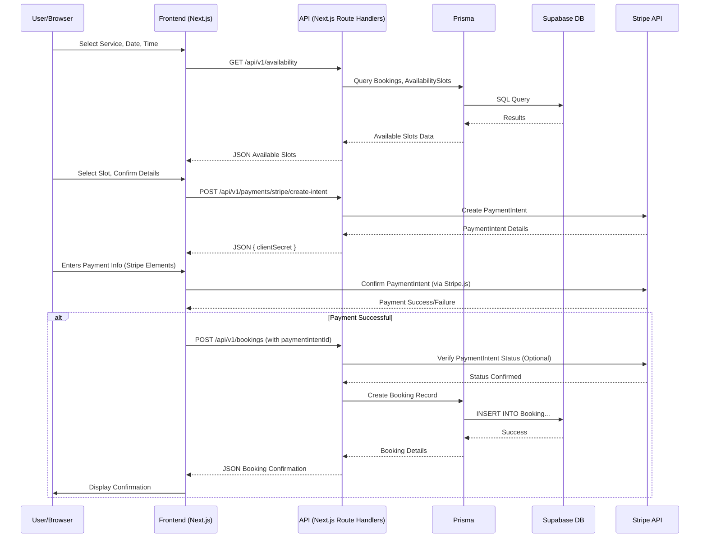

```markdown
# Software Requirements Specification: Project Aura

## System Design

*   **Frontend:** Next.js (App Router preferred for modern features like Server Components) web application. Utilizes React Server Components (RSC) for static/server-rendered parts and Client Components for interactive elements. Built with React, Tailwind CSS, Shadcn/ui, and Lucide Icons.
*   **Backend API:** Implemented using Next.js Route Handlers within the App Router. Organised logically (e.g., `/api/v1/users`, `/api/v1/services`).
*   **Database:** Supabase PostgreSQL instance. Accessed securely via Prisma ORM from backend API routes. Connection pooling managed by Prisma.
*   **Authentication:** Clerk Auth provides user management, authentication UI (components or hosted pages), session management (JWTs stored in secure httpOnly cookies), and backend verification middleware.
*   **Payments:** Stripe integration using `stripe-node` SDK on the backend (API routes) and `@stripe/react-stripe-js` + `@stripe/stripe-js` on the frontend for handling Payment Intents and interacting with Stripe Elements.
*   **CMS:** A dedicated section within the Next.js application (`/admin/...`) provides CRUD interfaces for managing core content models (Services, Products, Blog Posts, Team, Promotions, Tiers, etc.). Access controlled via Clerk roles. Data is stored directly in the Supabase DB via Prisma.
*   **Image/Media Storage:** Consider Supabase Storage or a dedicated CDN like Cloudinary for managing and serving images (therapist photos, service visuals, product images) efficiently. Optimize images using Next.js Image component or the CDN's features.
*   **Email/SMS:** Integration with an email service provider (e.g., Resend, SendGrid, AWS SES) via their SDK for sending transactional emails (booking confirmations, reminders, password resets if not handled by Clerk). Similar integration for SMS if required (e.g., Twilio). Triggered from backend API routes or potentially Supabase Edge Functions/Triggers.
*   **Background Jobs:** For tasks like sending scheduled reminders or processing bulk updates, consider:
    *   Scheduled Supabase Edge Functions (if suitable).
    *   A dedicated job queue service (e.g., Quirrel.dev, Inngest, or self-hosted BullMQ if running Node.js persistently on Hostinger).
*   **Deployment (Staging):** Vercel platform, leveraging its tight integration with Next.js, serverless functions, and preview deployments.
*   **Deployment (Production):** Hostinger VPS (or similar):
    *   Requires setting up Node.js environment.
    *   Use a process manager like `pm2` to run the Next.js application (`next start`) reliably.
    *   Configure a reverse proxy (e.g., Nginx) to handle incoming HTTPS traffic, route requests to the Node.js app, manage SSL certificates (Let's Encrypt), and potentially serve static assets.
    *   Ensure necessary environment variables (database URL, Clerk keys, Stripe keys, etc.) are securely configured.
    *   Set up logging and monitoring.

## Architecture pattern

*   **Monolithic Frontend/Backend (Next.js App Router):** Leverages Route Handlers for API logic colocated with frontend code structure. RSCs reduce client-side JavaScript bundle size.
*   **Serverless Compute Model (API Routes/Route Handlers):** Fits well with Vercel staging. On Hostinger, runs within a persistent Node.js server. Design API routes to be stateless where possible.
*   **Service-Oriented:** Decouples core concerns using managed services: Supabase (Database, Storage, Edge Functions), Clerk (Auth), Stripe (Payments), External Email/SMS provider.
*   **Component-Based UI:** Highly modular UI using React functional components, hooks, and Shadcn/ui primitives, promoting reusability and maintainability.
*   **Layered API Structure (Potential):** Consider organizing backend logic within API routes:
    *   Route Handler (validation, auth check) -> Service Layer (business logic) -> Repository/Prisma Layer (data access). This improves testability and separation of concerns as complexity grows.

## State management

*   **Client-Side UI State:** `useState`, `useReducer` for local component state.
*   **Global Client-Side State:** Zustand recommended for its simplicity and performance. Use it for:
    *   Shopping cart state (`items`, `total`).
    *   User preferences (e.g., selected language if not purely route-based).
    *   Maybe transient UI state like global loading indicators or notification queues (though Sonner handles notifications).
    *   Clerk's `useUser`, `useAuth` hooks provide auth state directly.
*   **Server Cache / Data Fetching State:** TanStack Query (React Query) v5 is highly recommended for:
    *   Declarative data fetching, caching, and synchronization with backend data within Client Components.
    *   Automatic background refetching, stale-while-revalidate strategies.
    *   Optimistic updates for a smoother UX on mutations (e.g., adding to cart, updating profile).
    *   Managing loading and error states elegantly.
    *   Integrates well with RSC data fetching for initial data hydration.

## Data flow

*   **Booking Flow Example:**
    1.  **User (Browser):** Selects service, date, time, therapist on Frontend UI (Client Component).
    2.  **Frontend:** Makes GET request to `/api/v1/availability?serviceId=...&date=...` using TanStack Query.
    3.  **API Route (`/api/v1/availability`):** Queries `Booking` and `AvailabilitySlot` tables via Prisma to determine available slots. Returns available slots JSON.
    4.  **Frontend:** Renders available slots. User selects a slot and confirms details.
    5.  **Frontend:** Makes POST request to `/api/v1/payments/stripe/create-intent` with booking amount (deposit or full).
    6.  **API Route (`/api/v1/payments/...`):** Calls Stripe API to create PaymentIntent. Returns `{ clientSecret }`.
    7.  **Frontend:** Uses Stripe.js and the `clientSecret` to mount Stripe Elements for payment input. User submits payment details.
    8.  **Frontend (Stripe.js):** Confirms PaymentIntent with Stripe.
    9.  **Frontend (On Success):** Makes POST request to `/api/v1/bookings` with `serviceId`, `therapistId`, `dateTime`, `userId`, `paymentIntentId`.
    10. **API Route (`/api/v1/bookings`):** Verifies PaymentIntent status with Stripe (optional but recommended). Creates `Booking` record in DB via Prisma. Returns booking details.
    11. **Frontend:** Shows confirmation message, potentially triggers TanStack Query cache invalidation for user's bookings.
    12. **(Async):** API Route or Webhook handler might trigger confirmation email/SMS.
*   **Token Redemption Flow Example:**
    1.  **User (Browser):** In checkout or booking summary, sees option "Redeem X Aura Tokens for $Y discount".
    2.  **Frontend:** User enables redemption. Sends updated checkout/booking details (including `redeemTokens: true` flag or amount) to relevant API route (e.g., PUT `/api/v1/cart/apply-discount` or during `POST /api/v1/bookings`).
    3.  **API Route:**
        *   Fetches user's `auraTokenBalance` and relevant `MembershipTier` details (for redemption rules/value) via Prisma.
        *   Validates if user has enough tokens and if redemption is applicable.
        *   Calculates discount amount based on tokens.
        *   (Crucially) If proceeding with purchase/booking:
            *   *Within a database transaction:*
                *   Create `AuraTokenTransaction` record with negative amount.
                *   Decrement `auraTokenBalance` on `User` record.
                *   Apply discount to the `Order` or `Booking` record being created/updated.
            *   Commit transaction.
        *   Return updated price/details to frontend.
    4.  **Frontend:** Reflects the applied discount.

*(Mermaid Sequence Diagram Syntax Example - Can be rendered by tools/markdown viewers)*



## Technical Stack

*   **Frontend Framework:** Next.js 14+ (App Router)
*   **UI Library:** React 18+
*   **UI Components:** Shadcn/ui
*   **Styling:** Tailwind CSS 3+
*   **Icons:** Lucide Icons (`lucide-react`)
*   **Notifications (Toast):** Sonner
*   **State Management (Client):** Zustand
*   **Data Fetching/Caching (Client):** TanStack Query (React Query) v5 (`@tanstack/react-query`)
*   **Forms:** React Hook Form (`react-hook-form`) with Zod (`zod`) for validation, integrates well with Shadcn/ui.
*   **Date Handling:** `date-fns` or Day.js (lightweight, good i18n support)
*   **Backend Runtime:** Node.js (LTS version)
*   **ORM:** Prisma Client
*   **Database:** Supabase (PostgreSQL 15+)
*   **Authentication:** Clerk Auth (`@clerk/nextjs`)
*   **Payment Gateway:** Stripe (`stripe`, `@stripe/react-stripe-js`, `@stripe/stripe-js`)
*   **Email:** Resend (`resend`) or similar SDK
*   **Language:** TypeScript 5+
*   **Linting/Formatting:** ESLint, Prettier
*   **Testing:**
    *   Unit/Integration: Jest, React Testing Library
    *   E2E: Playwright or Cypress
*   **Deployment (Staging):** Vercel CLI / Git Integration
*   **Deployment (Production):** Hostinger VPS, Nginx, PM2, Git (manual pull or CI/CD pipeline)

## Authentication Process

1.  **Trigger:** User interacts with Clerk components (`<SignInButton>`, `<SignUp>`, `<UserProfile>`) or navigates to sign-in/up routes managed by `@clerk/nextjs`.
2.  **Clerk Interaction:** User completes auth flow via Clerk's UI.
3.  **Token Management:** Clerk securely sets an httpOnly session cookie upon successful login. The frontend SDK synchronizes state via BroadcastChannel/LocalStorage for multi-tab awareness.
4.  **Frontend State:** `useUser()`, `useAuth()` hooks provide access to user object (`user.id`, `user.firstName`, etc.) and auth status (`isSignedIn`).
5.  **Backend Middleware:** Next.js Middleware (`middleware.ts`) uses `@clerk/nextjs/server`'s `clerkMiddleware` to protect routes. It reads the session cookie, verifies the JWT against Clerk's JWKS endpoint.
6.  **Backend Access:** In Route Handlers (or RSCs), use `auth()` helper from `@clerk/nextjs/server` to get authenticated user ID (`userId`) and session details.
7.  **Role-Based Access:**
    *   Store user roles ('ADMIN', 'THERAPIST', 'CUSTOMER') in your Supabase `User` table, linked by Clerk `userId`.
    *   In `clerkMiddleware` or individual Route Handlers, fetch the user's role from your DB based on the authenticated `userId`.
    *   Protect admin routes/actions by checking `if (userRole !== 'ADMIN') { throw new Error('Forbidden'); }`. Clerk's custom claims/roles can also be used but require syncing.
8.  **Logout:** `useAuth().signOut()` clears Clerk session cookies and frontend state.

## Route Design

*   **API Versioning:** Use `/api/v1/...` prefix for potential future API versions.
*   **Naming Conventions:** Use plural nouns for resource collections (e.g., `/api/v1/services`, `/api/v1/bookings`). Use specific verbs for non-CRUD actions (e.g., `/api/v1/payments/stripe/create-intent`).
*   **Admin Routes:** Group under `/admin/...` frontend routes. Corresponding API routes might be `/api/v1/admin/...` or rely on role checks within standard resource routes (e.g., `POST /api/v1/services` requires ADMIN role).
*   **Webhook Routes:**
    *   `/api/webhooks/stripe`: Verify signature using `stripe.webhooks.constructEvent` and Stripe webhook secret. Handle events like `payment_intent.succeeded`, `checkout.session.completed`.
    *   `/api/webhooks/clerk`: Verify signature using Clerk SDK. Handle events like `user.created`, `user.updated` to sync data to local DB if needed (e.g., creating a basic user profile).
*   **Protected Routes:** Defined in `middleware.ts` using `clerkMiddleware` config, matching specific paths (`/account/:path*`, `/admin/:path*`, specific API routes).

## API Design

*   **Standard Headers:**
    *   Requests: `Content-Type: application/json`, `Accept: application/json`. `Authorization: Bearer <Clerk_Session_Token>` (Handled automatically by Clerk middleware via cookies).
    *   Responses: `Content-Type: application/json`.
*   **Pagination:** For list endpoints (GET `/api/v1/services`, `/api/v1/bookings`, etc.):
    *   Query Parameters: `?page=1&limit=20`
    *   Response Body: `{ data: [...], pagination: { currentPage: 1, pageSize: 20, totalItems: 55, totalPages: 3 } }`
*   **Sorting:** `?sortBy=createdAt&order=desc`
*   **Filtering:** `?status=CONFIRMED&serviceId=...` (Specific filters per endpoint).
*   **Error Response Structure:**
    ```json
    {
      "error": {
        "message": "Validation Failed",
        "details": [
          { "field": "email", "message": "Invalid email format" },
          { "field": "password", "message": "Password too short" }
        ]
      }
    }
    // Or for simpler errors:
    { "error": { "message": "Booking not found" } }
    ```
*   **Detailed Payload Examples:**
    *   `POST /api/v1/bookings`
        *   Request: `{ serviceId: "cl...", therapistId: "cl...", startDateTime: "2024-01-15T10:00:00Z", paymentIntentId: "pi_...", notes: "Prefer gentle therapist" }`
        *   Response (201): `{ id: "bk_...", userId: "user_...", serviceId: "cl...", therapistId: "cl...", startDateTime: "...", status: "CONFIRMED", ... }`
    *   `GET /api/v1/users/me/membership` (Authenticated)
        *   Response (200): `{ userId: "user_...", currentTier: { id: "tier_elevated", name: "Elevated", retailDiscountPercent: 10, ... }, auraTokenBalance: 1500, pointsAccumulated: 8500, currentPeriodSpend: 1200.50, tierExpiryDate: "..." }`

## Database Design ERD

*(Refined Textual Description + Mermaid)*

*   **Constraints:** Add `NOT NULL` where appropriate (e.g., `User.email`, `Booking.userId`, `Booking.serviceId`, `Booking.startDateTime`). Add `UNIQUE` constraints (e.g., `User.email`, `Service.slug`, `Product.slug`, `Product.sku`). Use `ON DELETE` cascade behavior carefully (e.g., deleting a User might nullify `Booking.userId` or delete related `Membership`, TBD based on business rules).
*   **Indexing:** Create indexes on:
    *   Foreign Keys (`userId`, `serviceId`, `therapistId`, `orderId`, etc.).
    *   Fields used in frequent lookups/filters (`User.email`, `Booking.startDateTime`, `Service.slug`, `Product.slug`, `Order.status`).
    *   Fields used for sorting (`createdAt`, `startDateTime`).
*   **Data Types:** Use `TIMESTAMP WITH TIME ZONE` (TIMESTAMPTZ) for all timestamps. Use `TEXT` for variable length strings. `DECIMAL(10, 2)` for currency. `INTEGER` for counts/points. `BOOLEAN` for flags. `UUID` or `TEXT` (using `cuid()`) for primary keys. `TEXT[]` for arrays in PostgreSQL. `JSONB` for flexible structured data (e.g., `shippingAddress`). `ENUM` types for status fields.

```mermaid
erDiagram
    USER {
        TEXT id PK "Clerk User ID"
        TEXT firstName nullable
        TEXT lastName nullable
        TEXT email UK, NN
        TEXT phone nullable
        TIMESTAMPTZ createdAt NN
        TIMESTAMPTZ updatedAt NN
        INTEGER auraTokenBalance NN "default 0"
        USER_ROLE role NN "default CUSTOMER"
    }

    SERVICE {
        TEXT id PK "cuid/uuid"
        TEXT name NN
        TEXT slug UK, NN
        TEXT description NN
        SERVICE_CATEGORY category NN
        TEXT[] targetedConcerns nullable
        TEXT technologyUsed nullable
        INTEGER durationMinutes NN
        DECIMAL price NN
        BOOLEAN isActive NN "default true"
        TEXT imageUrl nullable
        TEXT preCareInstructions nullable
        TEXT postCareInstructions nullable
    }

    THERAPIST {
        TEXT id PK "cuid/uuid"
        TEXT userId FK nullable "Links to User table if therapist logs in"
        TEXT name NN
        TEXT title nullable
        TEXT bio nullable
        TEXT imageUrl nullable
        BOOLEAN isActive NN "default true"
    }

    THERAPIST_SERVICE {
        TEXT therapistId PK, FK
        TEXT serviceId PK, FK
    }

    AVAILABILITY_SLOT {
        TEXT id PK "cuid/uuid"
        TEXT therapistId FK, NN
        INTEGER dayOfWeek NN "0-6"
        TIME startTime NN
        TIME endTime NN
        DATE dateOverride nullable "For specific date availability/unavailability"
        BOOLEAN isAvailable NN "default true, false overrides dayOfWeek rule"
    }

    BOOKING {
        TEXT id PK "cuid/uuid"
        TEXT userId FK, NN
        TEXT serviceId FK, NN
        TEXT therapistId FK, NN
        TIMESTAMPTZ startDateTime NN
        TIMESTAMPTZ endDateTime NN
        BOOKING_STATUS status NN "default PENDING"
        DECIMAL priceAtBooking NN
        DECIMAL depositPaid NN "default 0"
        TEXT paymentIntentId nullable
        TEXT notes nullable
        TIMESTAMPTZ createdAt NN
        TIMESTAMPTZ updatedAt NN
    }

    MEMBERSHIP_TIER {
        TEXT id PK "cuid/uuid"
        TEXT name UK, NN
        INTEGER level UK, NN "0=Insider, 1=Elevated, 2=Zenith"
        DECIMAL minSpend nullable
        INTEGER minPoints nullable
        DECIMAL tokenEarnRateMultiplier NN "default 1.0"
        INTEGER retailDiscountPercent NN "default 0"
        BOOLEAN hasPriorityBooking NN "default false"
        BOOLEAN hasConciergeAccess NN "default false"
        TEXT otherPerksDescription nullable
    }

    MEMBERSHIP {
        TEXT id PK "cuid/uuid"
        TEXT userId UK, FK, NN
        TEXT membershipTierId FK, NN
        TIMESTAMPTZ joinedDate NN
        INTEGER pointsAccumulated NN "default 0"
        DECIMAL currentPeriodSpend NN "default 0"
        TIMESTAMPTZ tierExpiryDate nullable
        TIMESTAMPTZ updatedAt NN
    }

    AURA_TOKEN_TRANSACTION {
        TEXT id PK "cuid/uuid"
        TEXT userId FK, NN
        INTEGER amount NN "Positive earned, Negative redeemed"
        TOKEN_TRANSACTION_TYPE type NN
        TEXT description nullable
        TEXT relatedBookingId FK nullable
        TEXT relatedOrderId FK nullable
        TIMESTAMPTZ createdAt NN
    }

    PRODUCT {
        TEXT id PK "cuid/uuid"
        TEXT name NN
        TEXT slug UK, NN
        TEXT description NN
        DECIMAL price NN
        TEXT sku UK nullable
        INTEGER stockQuantity NN "default 0"
        TEXT imageUrl nullable
        TEXT category nullable
        BOOLEAN isActive NN "default true"
    }

    ORDER {
        TEXT id PK "cuid/uuid"
        TEXT userId FK, NN
        ORDER_STATUS status NN "default PENDING"
        DECIMAL totalAmount NN
        DECIMAL discountAmount NN "default 0"
        TEXT redeemedTokensAmount nullable "Informational, amount deducted via transaction"
        JSONB shippingAddress nullable
        TEXT paymentIntentId nullable
        TIMESTAMPTZ createdAt NN
        TIMESTAMPTZ updatedAt NN
    }

    ORDER_ITEM {
        TEXT id PK "cuid/uuid"
        TEXT orderId FK, NN
        TEXT productId FK, NN
        INTEGER quantity NN
        DECIMAL priceAtOrder NN
    }

    PROMOTION {
        TEXT id PK "cuid/uuid"
        TEXT code UK nullable
        TEXT description NN
        PROMOTION_TYPE discountType NN
        DECIMAL discountValue NN
        TEXT[] applicableServiceIds nullable
        TEXT[] applicableProductIds nullable
        INTEGER usageLimit nullable
        INTEGER currentUsageCount NN "default 0"
        TIMESTAMPTZ startDate NN
        TIMESTAMPTZ endDate nullable
        BOOLEAN isActive NN "default true"
    }

    BLOG_POST {
        TEXT id PK "cuid/uuid"
        TEXT title NN
        TEXT slug UK, NN
        TEXT content NN
        TEXT authorId FK nullable "FK to User"
        TIMESTAMPTZ publishedDate nullable
        CONTENT_STATUS status NN "default DRAFT"
        TEXT imageUrl nullable
        TIMESTAMPTZ createdAt NN
        TIMESTAMPTZ updatedAt NN
    }

    USER ||--o{ BOOKING : "places"
    USER ||--o{ ORDER : "places"
    USER ||--o| MEMBERSHIP : "has one"
    USER ||--o{ AURA_TOKEN_TRANSACTION : "has"
    MEMBERSHIP }|--|| MEMBERSHIP_TIER : "belongs to"
    SERVICE ||--|{ BOOKING : "is for"
    THERAPIST ||--|{ BOOKING : "performs"
    THERAPIST ||o--o{ THERAPIST_SERVICE : "performs"
    SERVICE ||o--o{ THERAPIST_SERVICE : "can be performed by"
    THERAPIST ||--o{ AVAILABILITY_SLOT : "has"
    AURA_TOKEN_TRANSACTION }|..o| BOOKING : "related to"
    AURA_TOKEN_TRANSACTION }|..o| ORDER : "related to"
    ORDER ||--|{ ORDER_ITEM : "contains"
    PRODUCT ||--|{ ORDER_ITEM : "details"
    BLOG_POST }|..o| USER : "written by"

    (Enum definitions like USER_ROLE, BOOKING_STATUS etc. defined separately in Prisma schema)

```