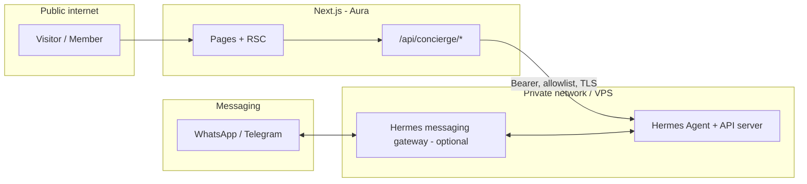

# Hermes Agent Integration & “Beauty × Tech” Revamp Plan

**Status:** Planning (baseline code tagged `pre-revamp` on `main`)  
**Primary code:** `aura-project-v1` (Next.js App Router, Clerk, treatment pages, admin, blog)  
**Related vision docs:** [Aura-Project - Product Owner Ideas Document](./Aura-Project%20-%20Product%20Owner%20Ideas%20Document.md), [PRD](./Aura-Project%20-%20Product%20Requirements%20Document.md), [SRS](./Aura-Project%20-%20Software%20Requirements%20Specification.md)

---

## 1. Purpose of this document

Consolidate **brainstorming, architecture choices, and a careful delivery sequence** for:

- Positioning Aura as a **tech-forward HK beauty** destination (retention + booking, not hype alone).
- Optional use of **[Nous Hermes Agent](https://github.com/NousResearch/hermes-agent)** as an **AI gateway** (OpenAI-compatible API, messaging gateway, skills/memory), aligned with official docs: [Hermes documentation](https://hermes-agent.nousresearch.com/docs/) including [API server](https://hermes-agent.nousresearch.com/docs/user-guide/features/api-server) and [MCP](https://hermes-agent.nousresearch.com/docs/user-guide/features/mcp).

This plan **does not** assume every idea in external “Beauty × Crypto × AI” pitch decks is launch-safe (legal, clinical marketing, or engineering). It separates **MVP**, **phase 2**, and **explicitly deferred** items.

---

## 2. Executive summary

| Question | Recommendation |
|----------|----------------|
| Greenfield new repo? | **No** for positioning alone. Revamp **in place** on existing Next.js app unless stack or security forces a split (see §10). |
| Hermes on day one? | **Optional.** Ship **Next.js Route Handler → LLM** first if time-to-market matters; add Hermes when you need **gateway (WhatsApp/Telegram), cron, skills loop**, or a **dedicated agent host**. |
| Browser → `localhost:8642`? | **Never in production.** Hermes (or any LLM gateway) sits **server-side** or on a **private VPS**; the public site calls **only** your Next API (auth, rate limits, audit). |
| NFT / USDT at launch? | **Defer.** Product Owner doc already treats on-chain loyalty as **exploratory**. Launch **Clerk + DB “Aura Tokens”** (closed loop) first; revisit NFT/crypto with legal/product review. |

---

## 3. What Hermes Agent is (in Aura context)

Hermes is a **Python-based agent runtime** with:

- **OpenAI-compatible HTTP API** (documented port for local dev is commonly cited as **8642**; treat port as **configurable** per [API server](https://hermes-agent.nousresearch.com/docs/user-guide/features/api-server) docs).
- **Messaging gateway** (Telegram, Discord, Slack, WhatsApp, etc.) for “concierge outside the website.”
- **Memory, skills, MCP, scheduling** for longer-lived operator workflows.

**Implication:** Hermes is **not** a drop-in React component. Integration is **infrastructure + one thin API layer** in Aura, not a replacement for Next.js.

---

## 4. Target architecture (recommended)

**Rules:**

1. **All** browser chat traffic: `U → Aura /api/...` only.
2. Aura server (Route Handler or server action) forwards to Hermes **or** to OpenAI/OpenRouter/etc.
3. Secrets (`HERMES_API_KEY`, model keys) **only** on server env (Vercel / VPS), never `NEXT_PUBLIC_*` for privileged keys.

---

## 5. Hermes vs “LLM inside Next only”

| Capability | Hermes path | Next-only LLM (e.g. Vercel AI SDK + provider) |
|------------|-------------|-----------------------------------------------|
| Website chat MVP | Possible, adds ops | **Faster**, fewer moving parts |
| WhatsApp / Telegram concierge | **Strong fit** (gateway) | Requires separate BSP or custom bridge |
| Skills / self-improving loop | **Hermes differentiator** | Not native; you’d build custom |
| Memory across sessions | Hermes + policies | Your DB + RAG + strict PII policy |
| Team already runs Hermes 24/7 | Hermes wins | N/A |

**Decision guideline:** Start **Next-only** for `/concierge` MVP **if** the goal is HK-language Q&A + routing to booking links. Introduce **Hermes** when you commit to **messaging-channel parity** or **operator-grade** agent tooling.

---

## 6. Phased roadmap (careful order)

### Phase 0 — Product & IA (no new infra)

- One **primary user job:** choose concern → understand treatment → **book / WhatsApp**.
- Reduce overlapping routes; strengthen **mobile CTA** on treatment templates.
- Replace homepage **mocks** with admin/CMS-backed or DB-backed content when available.

### Phase 1 — AI Concierge MVP (Aura-owned API)

- New routes: e.g. `src/app/concierge/page.tsx` + `src/app/api/concierge/chat/route.ts`.
- **System prompt** grounded in **approved salon copy** (services, contraindications, “not medical advice”).
- Languages: **EN / 繁中** (align with existing `LanguageProvider`).
- Guardrails: rate limit, max tokens, logging, **human handoff** (phone, WhatsApp, in-salon).
- **No** client-side calls to Hermes URL.

### Phase 2 — Booking & retention glue

- Deep links: Cal.com / Calendly / WhatsApp Business **from** concierge replies.
- Email/SMS reminders per SRS (Resend/Twilio) — can be **outside** Hermes initially.
- Optional: Hermes **cron** for internal summaries / staff digests (not customer medical content).

### Phase 3 — Hermes as private gateway (optional)

- Deploy Hermes on **VPS** (or approved host), TLS + IP allowlist or mTLS from Aura API egress.
- Configure [API server](https://hermes-agent.nousresearch.com/docs/user-guide/features/api-server) auth; rotate keys.
- Aura `POST /api/concierge/chat` proxies to `https://hermes.internal.../v1/chat/completions` with **salon system prompt** and tool policy.

### Phase 4 — Messaging channels

- `hermes gateway` for **WhatsApp/Telegram** per [messaging docs](https://hermes-agent.nousresearch.com/docs/user-guide/messaging).
- Website and messaging share **same business rules** (pricing snippets, booking links) via a small **policy JSON** or DB to avoid drift.

### Phase 5 — Loyalty & “crypto trend”

- **Ship:** Clerk user + **Aura Circle / Aura Tokens** in app DB (per Product Owner doc).
- **Explore later:** NFT tiers, USDT checkout — **only** with legal/accounting sign-off and support processes.

---

## 7. Feature brainstorm (mapped to prudence)

Ideas from market / strategy research, **classified**:

| Feature | Value | Launch tier | Notes |
|---------|--------|-------------|--------|
| AI skin / treatment Q&A | High | Phase 1 | Ground in salon-approved facts; no diagnosis. |
| AR try-on (Banuba / Perfect Corp) | Medium | Phase 2+ | Licensing, brand fit, performance on mobile. |
| Smart booking agent | High | Phase 2 | Start with **links + structured intake**; full auto-booking is hard. |
| Post-visit AI tips | Medium | Phase 3–4 | Prefer **opt-in** WhatsApp; watch PIPL/privacy messaging. |
| NFT loyalty | Uncertain | Phase 5 exploratory | Align with existing “not core launch” stance in Ideas doc. |
| Crypto checkout | Uncertain | Phase 5+ | Heavy compliance; not a website-only toggle. |
| AI before/after **generator** | Risky | **Defer / avoid** | Misrepresentation and advertising-law risk in beauty. |
| Auto blog from agent research | Low–medium | Phase 4 | Needs **human editorial** pass for brand and claims. |

---

## 8. Security & compliance checklist (non-negotiable)

- [ ] No privileged LLM keys in browser bundles.
- [ ] Rate limiting + abuse monitoring on `/api/concierge/*`.
- [ ] **PII minimization** in logs; retention policy for chat transcripts.
- [ ] **HK PDPO / PIPL** awareness for cross-border processing if using overseas APIs.
- [ ] Marketing: avoid **medical claims**; label AI output as **informational**.
- [ ] Hermes host: **TLS**, firewall, non-root service user, automated updates.

---

## 9. Engineering backlog (starter tickets)

1. **Docs:** This file + PMP cross-link (done when merged).
2. **IA:** Navigation audit doc + redirect map (treatment duplicates).
3. **Concierge:** `/concierge` UI + `/api/concierge/chat` stub (returns static FAQ until model wired).
4. **Config:** `HERMES_BASE_URL`, `HERMES_API_KEY` (optional) + `OPENAI_API_KEY` / `OPENROUTER_API_KEY` for fallback — **server only**.
5. **Tests:** Playwright smoke for concierge page + API 401 without session (if auth required).
6. **Observability:** Structured logs for model errors (no PII in message bodies in logs).

---

## 10. When to reconsider a new repository

Create a **new** Next.js app only if:

- Security review demands **isolation** of experimental agent surface from admin/CMS, **or**
- You adopt a **different deployment model** (e.g. separate `apps/web` monorepo with shared UI package).

Otherwise: **tag + branch** from `main` (e.g. `revamp/concierge`) and merge incrementally.

---

## 11. References

- Hermes Agent repo: https://github.com/NousResearch/hermes-agent  
- Hermes docs hub: https://hermes-agent.nousresearch.com/docs/  
- API server feature: https://hermes-agent.nousresearch.com/docs/user-guide/features/api-server  
- MCP integration: https://hermes-agent.nousresearch.com/docs/user-guide/features/mcp  
- Messaging gateway: https://hermes-agent.nousresearch.com/docs/user-guide/messaging  

Internal: **Memory MCP** in this repo remains a **developer memory tool**, not the customer-facing concierge; do not conflate the two in architecture diagrams for stakeholders.

---

## 12. Document maintenance

| Trigger | Action |
|---------|--------|
| Hermes major version / API path change | Update §3–§4 and env names; link new upstream doc. |
| Phase completed | Move items in [Project Management Plan](./Project%20Management%20Plan.md) “Completed Tasks” with date. |
| Legal stance on NFT/crypto | Update §6 Phase 5 and §7 table. |

**Last updated:** 2026-04-18
