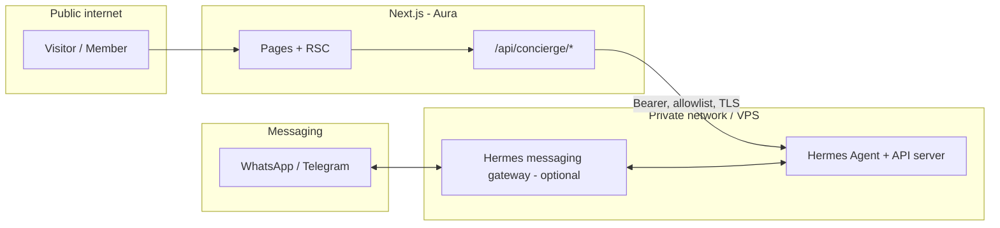
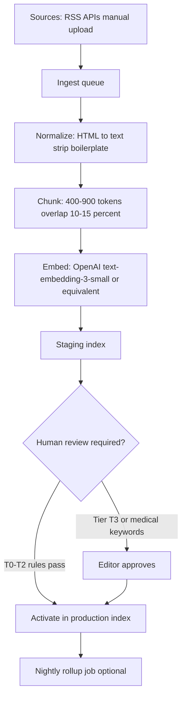
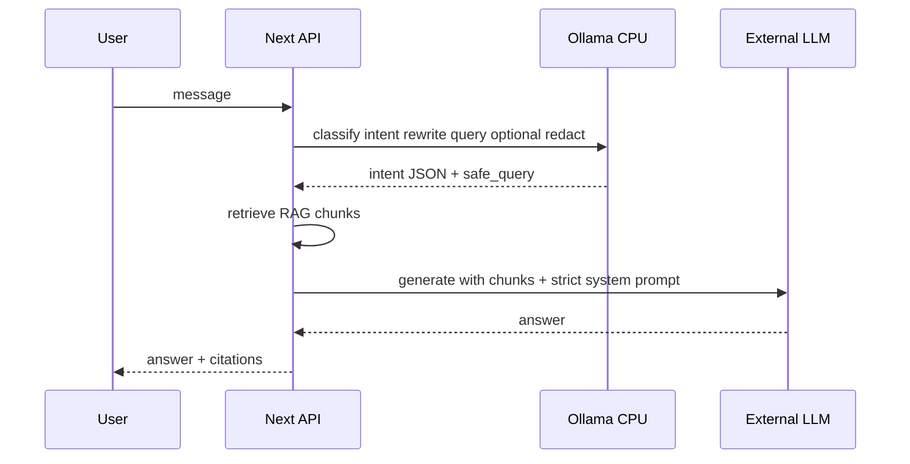

# Hermes Agent Integration & “Beauty × Tech” Revamp Plan

**Status:** In progress (MVP concierge + Knowledge Bank foundations implemented)  
**Primary code:** `aura-project-v1` (Next.js App Router, Clerk, treatment pages, admin, blog)  
**Related vision docs:** [Aura-Project - Product Owner Ideas Document](./Aura-Project%20-%20Product%20Owner%20Ideas%20Document.md), [PRD](./Aura-Project%20-%20Product%20Requirements%20Document.md), [SRS](./Aura-Project%20-%20Software%20Requirements%20Specification.md)

---

## Implementation status (living checklist)

**Last updated:** 2026-05-03

### Progress tracking (snapshot)

**Priority order (agreed):** **Finish development first** — IA, ops UI, optional trend pages, quality gates (evals, smoke tests), voice/TTS and Hermes only as scoped. **Website content QA** (broken images, copy passes) is **explicitly last** after dev milestones are closed.

| Track | Current focus | Notes |
|-------|----------------|-------|
| **Development (Next.js)** | Close remaining checklist items below; pick **one slice per sprint** from “Next engineering slices” | Content/image fixes **deferred** until dev slice is done |
| **Content QA** | **Last** — broken images route-by-route, editorial pass | Run after dev checklist for launch is satisfied |
| **Ops on Hostinger** | **`curl` + cron secrets** for ingest, rollup, retention (README); `vercel.json` optional on Vercel | `KB_INGEST_CRON_SECRET`, optional `KB_ROLLUP_*`, `CONCIERGE_RETENTION_SECRET`, `CRON_SECRET` if host sends Bearer |

**Recently landed in repo (high level):** KB-1 RSS + HTML ingest → T3 staging; promote endpoints + audit fields; admin knowledge actions; rollup generation extracted to `knowledge-rollup-generation.service.ts`; scheduled rollup + retention routes + `internal-cron-auth`; README ops; optional `vercel.json` schedules.

**Next engineering slices (pick one per sprint):** (1) navigation / IA audit + redirects (see [.documentation/IA-redirect-map.md](./IA-redirect-map.md)), (2) ~~admin retention run UI~~ **done** (`/admin/concierge`), (3) optional **trend topic pages**, (4) expand golden set + Playwright smoke — **starter:** `tests/concierge.spec.ts` (page load + composer). **Defer to after dev:** bulk content QA. **Defer later:** Hermes gateway, loyalty; **Voice-1 baseline shipped** (see §0 below).

### Shipped / implemented in repo

- [x] **Soft dreamy promo poster** UI theme tokens + key shadcn variants (`Button`, `Card`, `Badge`)
- [x] **`zh-HK` default** site language (layout + language provider/switcher)
- [x] **AI Concierge page** `src/app/concierge/page.tsx` (text chat UI)
- [x] **Floating chat widget (Phase 1b)**: bottom-right launcher + popup modal (reuses same chat component + API)
- [x] **Concierge API** `src/app/api/concierge/chat/route.ts` with OpenRouter integration + fallback
- [x] **Per-user persistent chat history** (Clerk `userId`): DB threads/messages + `/api/concierge/history*` + auto-restore after re-login
- [x] **Concierge safety/ops baseline**:
  - Rate limiting (DB-backed) across `/api/concierge/*`
  - Abuse monitoring events (hashed IP only; no message bodies)
  - Retention cleanup `GET`/`POST /api/concierge/retention/run` (`?token=` / `x-internal-token` / `Authorization: Bearer` when `CRON_SECRET` set) with **180-day** default retention (`CONCIERGE_RETENTION_DAYS`)
  - **Vercel Cron** (`vercel.json`): daily rollup job + weekly retention (see `.env.local.example`: `CRON_SECRET`, rollup envs)
- [x] **Basic RAG grounding** from Knowledge Bank (T0 active docs) + `kbHits` in response
- [x] **KB-2 embeddings (baseline)**: store chunk embeddings + hybrid keyword→vector rerank retrieval
- [x] **KB-2 ops**: admin “Backfill embeddings” tool for older chunks
- [x] **Trends path**: rollups retrieval + trend-query routing (rollups prioritized for trend questions)
- [x] **Knowledge Bank (KB-0)**: Prisma schema + Postgres tables + admin upload UI + list APIs
- [x] **Trends admin UI** + rollup generation API (OpenRouter summarization)
- [x] **Auth hardening** for knowledge APIs (Clerk session works; avoids prior 401 pitfalls)
- [x] **Clerk middleware matcher hardening**: align with Clerk-recommended `matcher` to reduce auth() / 404 edge-case errors
- [x] **KB-1 ingestion + staging→promote** (T3 never auto-publishes; governance via dedicated APIs):
  - **RSS/Atom → T3 `staging`**: `POST /api/knowledge/ingest/run?token=...` (cron secret) + `POST /api/knowledge/ingest/admin/run` (Clerk); optional `KB_INGEST_FEEDS_JSON`, caps/timeouts in `.env.local.example`
  - **HTML list pages → T3 `staging`**: `POST /api/knowledge/ingest/html/run?token=...` + `POST /api/knowledge/ingest/html/admin/run`; optional `KB_INGEST_HTML_SOURCES_JSON`, `KB_INGEST_HTML_MAX_*`
  - **Runs log**: `GET /api/knowledge/ingest/runs` (admin) for ingestion audit
  - **Promotion**: `POST .../promote/activate` (staging→active), `POST .../promote/approve-t3-to-t2` (T3 staging→T2 active); `KnowledgeDocument.approvedAt` / `approvedByUserId`; generic document PATCH does **not** bypass tiers for T3
  - **Admin UI**: `/admin/knowledge` triggers ingest + promote actions (aligned with routes above)
- [x] **KB-3 scheduled rollups**: shared generator `src/services/knowledge-rollup-generation.service.ts`; cron route `GET|POST /api/knowledge/rollups/cron/run` (auth: `CRON_SECRET` Bearer and/or `KB_ROLLUP_CRON_SECRET` / `KB_INGEST_CRON_SECRET`); optional `KB_ROLLUP_TOPICS_JSON`; `vercel.json` schedule `0 3 * * *` (UTC)

### In progress / next

- [ ] **KB-3 public trend pages** (optional): marketing/SEO routes fed primarily from rollups (concierge already prefers rollups for trend-style queries)
- [ ] **KB-1 polish** (optional): dedicated **staging inbox** / stronger filters in admin (workflow is already enforceable via API + current list)
- [x] **KB-2 quality hardening (baseline)**:
  - Golden set runner `npm run eval:concierge` (starter set)
  - Locale drift guard (zh-HK): one retry with stricter instruction if reply drifts to English
  - Citations UI trims long lists (top sources + “+N more”)
  - Server-side model timeout + graceful fallback (`CONCIERGE_MODEL_TIMEOUT_MS`, `fallbackReason: "timeout"`)
- [x] **Concierge ops**: admin **retention run** UI — `/admin/concierge` → `POST /api/admin/concierge/retention/run` (Clerk); cron/secret routes unchanged (`README`)
- [x] **Voice-0 / TTS-0 (client)** — Web Speech + `speechSynthesis` on `ConciergeChat` (`NEXT_PUBLIC_CONCIERGE_VOICE_UI`); **TTS-0** per assistant message.
- [x] **Voice-1 (baseline)** — `POST /api/concierge/transcribe`: OpenRouter chat + default Voxtral (`input_audio`); client re-encode to **MP3** (lamejs) or **WAV** fallback for Mistral-compatible uploads; rate limits on route. **Still open for “production hardening”:** optional cloud TTS (**TTS-1**), expanded legal/consent copy, STT vendor DPAs where required.
- [ ] **TTS-1 (production)** — optional cloud neural TTS route + quotas + contract review (§4.2.3)
- [ ] **Hermes gateway** (Phase 3–4) and messaging channels (WhatsApp/Telegram)
- [ ] **Loyalty** (closed-loop points) + deferred crypto/NFT exploration

## 1. Purpose of this document

Consolidate **brainstorming, architecture choices, and a careful delivery sequence** for:

- Positioning Aura as a **tech-forward HK beauty** destination (retention + booking, not hype alone).
- **Conversational AI (“chatbot”)** on the **website** (AI Concierge UI + `/api/concierge/chat`) and, later, the **same policy** on **WhatsApp / Telegram** via Hermes gateway (§6 Phase 4) — one product voice, multiple surfaces.
- Optional use of **[Nous Hermes Agent](https://github.com/NousResearch/hermes-agent)** as an **AI gateway** (OpenAI-compatible API, messaging gateway, skills/memory), aligned with official docs: [Hermes documentation](https://hermes-agent.nousresearch.com/docs/) including [API server](https://hermes-agent.nousresearch.com/docs/user-guide/features/api-server) and [MCP](https://hermes-agent.nousresearch.com/docs/user-guide/features/mcp).

This plan **does not** assume every idea in external “Beauty × Crypto × AI” pitch decks is launch-safe (legal, clinical marketing, or engineering). It separates **MVP**, **phase 2**, and **explicitly deferred** items.

**Implementation depth:** **§4.2** (WCAG-aligned chat UI + **Cantonese / Mandarin voice input** + optional **TTS read-aloud**), **§7** (knowledge bank, RAG at scale, improvement without RL), and **§8** (optional **Ollama** CPU sidecar, model picks, hybrid routing) are the **execution specs** to follow after the executive roadmap in **§6**.

---

## 2. Executive summary

| Question | Recommendation |
|----------|----------------|
| Greenfield new repo? | **No** for positioning alone. Revamp **in place** on existing Next.js app unless stack or security forces a split (see §10). |
| Hermes on day one? | **Optional.** Ship **Next.js Route Handler → LLM** first if time-to-market matters; add Hermes when you need **gateway (WhatsApp/Telegram), cron, skills loop**, or a **dedicated agent host**. |
| Browser → `localhost:8642`? | **Never in production.** Hermes (or any LLM gateway) sits **server-side** or on a **private VPS**; the public site calls **only** your Next API (auth, rate limits, audit). |
| NFT / USDT at launch? | **Defer.** Product Owner doc already treats on-chain loyalty as **exploratory**. Launch **Clerk + DB “Aura Tokens”** (closed loop) first; revisit NFT/crypto with legal/product review. |
| Beauty “databank” + trends? | **§7:** Postgres + vectors + **trust tiers** + ingestion + rollups; **not** “local LLM = infinite knowledge.” |
| Local CPU LLM on Hostinger? | **§8:** **Optional** after KB-2; default **external** generation; local for **routing / redaction** only if needed; **no RL training** on VPS. |
| HK default language & chatbot? | **§4.1:** **Traditional Chinese (Hong Kong) `zh-HK`** is the **default** for site UI, knowledge **T0**, system prompts, and **chatbot replies**; EN / 繁中（其他地區）/ 简中 as explicit switches. **Yes — chatbot** = AI Concierge (§6 Phase 1 + optional Phase 1b widget). |
| Accessibility & voice? | **§4.2:** Chat UI targets **WCAG 2.1 AA**; **voice input** for **Cantonese + Mandarin** via managed STT (recommended) with browser fallback where possible; **Phase 2** for first production voice path. |
| Read replies aloud (TTS)? | **§4.2.3:** Optional **per-message** play; **separate consent** from STT; **TTS-0** browser `speechSynthesis` and/or **TTS-1** cloud neural voices (`zh-HK` / Cantonese + Mandarin); **no autoplay** — user gesture per play; default **off**. |

---

## 3. What Hermes Agent is (in Aura context)

Hermes is a **Python-based agent runtime** with:

- **OpenAI-compatible HTTP API** (documented port for local dev is commonly cited as **8642**; treat port as **configurable** per [API server](https://hermes-agent.nousresearch.com/docs/user-guide/features/api-server) docs).
- **Messaging gateway** (Telegram, Discord, Slack, WhatsApp, etc.) for “concierge outside the website.”
- **Memory, skills, MCP, scheduling** for longer-lived operator workflows.

**Implication:** Hermes is **not** a drop-in React component. Integration is **infrastructure + one thin API layer** in Aura, not a replacement for Next.js.

For a concise **upstream vs Aura vs planned Hermes phases** comparison, see **§7.6.1**.

---

## 4. Target architecture (recommended)

**Rules:**

1. **All** browser chat traffic: `U → Aura /api/...` only.
2. Aura server (Route Handler or server action) forwards to Hermes **or** to OpenAI/OpenRouter/etc.
3. Secrets (`HERMES_API_KEY`, model keys) **only** on server env (Vercel / VPS), never `NEXT_PUBLIC_*` for privileged keys.

### 4.1 Hong Kong primary audience: language defaults & chatbot surfaces

**Primary market:** Hong Kong residents and visitors who expect **Traditional Chinese for Hong Kong (`zh-HK`)** as the **default written language** across the marketing site **and** the **beauty AI chatbot** (AI Concierge). English is common in HK; **Simplified Chinese** may be needed for cross-border visitors — both are **opt-in** via the existing site language pattern (e.g. `LanguageProvider` + persisted preference), not silent defaults.

**Chatbot — explicitly in scope**

| Surface | Plan reference | Notes |
|---------|----------------|--------|
| **Website AI chatbot** | **§6 Phase 1** — route `src/app/concierge/page.tsx` + `src/app/api/concierge/chat/route.ts` | Full-page concierge MVP; mobile-first. |
| **Floating entry (optional)** | **Phase 1b** (same API) | e.g. bottom-right “問我” launcher linking to `/concierge` or embedded thread — product choice; **same** `locale` and safety rules. |
| **WhatsApp / Telegram “chatbot”** | **§6 Phase 4** + optional Hermes gateway | Same **salon facts, locale policy, and handoff** as web; staff sees overlapping threads in CRM later (out of scope here). |

**Language & locale rules (engineering)**

1. **Default locale:** `zh-HK` when no cookie/header/profile preference is set (align with HK-first positioning in PRD / Ideas doc).
2. **Every** `POST /api/concierge/chat` body (or session) carries `locale`: `zh-HK` \| `en` \| `zh-Hant` (non-HK) \| `zh-Hans` as agreed enum — **never infer only from model**; optional `script_hint` if UI adds Colloquial Cantonese input mode later. If **voice** is used (§4.2), the client sends the same `locale` chosen **before** recording (or derived from site language), plus optional `asr_provider` metadata for debugging — **not** raw audio to analytics.
3. **System prompt** is **locale-aware**: instructions and few-shot examples in the **target reply language**; forbid flipping to English mid-reply unless user message is English or user selected EN.
4. **RAG retrieval** (§7.5): prefer chunks where `knowledge_documents.language` matches `locale`; if no `zh-HK` hit for a T0 fact, fall back to **closest Traditional** chunk + short line offering human / EN FAQ — log `missing_locale_hit` for KB backfill.
5. **T0 content pipeline:** author and approve **zh-HK first**, then EN (then others); ingestion (§7.4) tags locale per chunk.
6. **Golden / regression set** (§7.7): **at least ~70%** of cases in **zh-HK** (written 繁體中文，香港用字習慣); remainder EN and **zh-Hans** as needed — mirrors real search and WhatsApp mix.
7. **Colloquial Cantonese (口語書寫):** users may type spoken Cantonese particles/loanwords; model should respond in **professional salon register** in **Traditional Chinese** unless marketing explicitly approves a “街坊” tone for a campaign — document in brand guidelines.

### 4.2 Accessibility (WCAG) & voice input (Cantonese / Mandarin)

**Why:** HK users are **mobile-first**; many prefer **speaking** (Cantonese 廣東話, or **Mandarin** 普通話/國語—tourists, mainland visitors, or personal preference). A concierge that is **keyboard- and screen-reader-friendly** and offers **optional mic input** reduces friction and matches the brand’s “tech-forward” positioning without forcing voice on everyone.

#### 4.2.1 Chat UI — accessibility baseline (target **WCAG 2.1 Level AA**)

Align with [Aura-Project - Product Requirements Document](./Aura-Project%20-%20Product%20Requirements%20Document.md) accessibility expectations where applicable.

| Area | Requirement (concierge-specific) |
|------|-----------------------------------|
| **Keyboard** | Full thread composer, send, close/minimize (if widget), and “human handoff” reachable **without** mouse; visible focus rings; **Esc** closes overlays; no focus trap loops. |
| **Screen readers** | Message list in a **live region** (`aria-live="polite"` for streaming token batches; **assertive** only for errors); each message **role** + timestamp; assistant vs user labelled in **`zh-HK` + EN** `aria-label` where mixed locales exist. |
| **Semantics** | Landmark: `main` for page; chat as `region` with `aria-labelledby`; form fields with associated `<label>` / `aria-describedby` for char limits and **AI disclaimer**. |
| **Visual** | **Contrast** for coral/turquoise on white and on chat bubbles (check both light states); **respect `prefers-reduced-motion`** for typing/streaming animations. |
| **Input modes** | **Text input always available** — voice is an **add-on**, not a gate. |
| **Testing** | Automated: **axe-core** or `@axe-core/playwright` on `/concierge`; manual: VoiceOver (iOS) + TalkBack (Android) smoke on composer + live region behaviour. |
| **TTS controls (when §4.2.3 enabled)** | **Per-message** “朗讀 / Read aloud” control with **Stop**; **no autoplay** of assistant audio (WCAG **audio control**); keyboard-focusable; `aria-pressed` or `aria-busy` while fetching/playing cloud audio; respect **`prefers-reduced-motion`** (offer text-only or disable auto-scroll-to-speaker highlights). |

**Phase placement:** ship **§4.2.1 checklist** together with **§6 Phase 1** (text MVP); do not defer WCAG to “after launch” if the chatbot is public.

#### 4.2.2 Voice input — Cantonese & Mandarin (STT → text → same `/api/concierge/chat`)

**Goal:** User taps **🎤**; audio is transcribed to **Unicode text**; transcript is sent through the **same** chat pipeline as typed Chinese so **RAG, locale, and safety** stay unified.

**Browser reality**

- **Web Speech API** (`SpeechRecognition`): zero marginal cost and easy demo, but **language pack quality varies wildly** by OS/browser; **Cantonese** support is historically uneven (often better on Chrome/Android than Safari). Treat as **progressive enhancement** only, not the sole production path.
- **Production recommendation:** **managed speech-to-text (STT)** with explicit **Cantonese + Mandarin** models/locales, called from a **Route Handler** `POST /api/concierge/transcribe` (multipart audio) or short-lived presigned upload → worker → text. Examples of families to evaluate (pick one vendor after POC): **Azure AI Speech**, **Google Cloud Speech-to-Text**, **AWS Transcribe**, **OpenAI** / other APIs that expose **yue** / **cmn** locales. **No** raw audio stored longer than needed for transcription unless **opt-in** retention is legally approved.

**Locale binding (critical)**

| User intent (UI) | Typical STT / BCP-47 hint | Post-STT `locale` passed to chat |
|------------------|---------------------------|-------------------------------------|
| HK Cantonese speech | `yue-Hant-HK` or vendor **`zh-HK`** Cantonese mode | **`zh-HK`** (reply in professional 繁體) |
| Mandarin (Simplified) speech | `cmn-Hans` | **`zh-Hans`** |
| Mandarin (Traditional, TW/HK learner) | `cmn-Hant` | **`zh-Hant`** or **`zh-HK`** per product rule |
| English speech | `en-HK` or `en` | **`en`** |

After STT, run the same **PII redaction** policy as typed text (§8.1) before forwarding to the external LLM if required.

**Privacy & consent (link §10)**

- Mic button shows **short disclosure** (what is sent, retention seconds, purpose).
- **PDPO:** purpose limitation for voice; avoid logging raw audio; delete blob after transcript or error.

**Phasing**

| Sub-phase | Deliverable |
|-----------|-------------|
| **Voice-0 (dev)** | Web Speech API behind feature flag for internal QA only. |
| **Voice-1 (MVP production)** | One chosen **vendor STT** + `/api/concierge/transcribe` + **zh-HK / cmn-Hans / cmn-Hant** happy paths; max audio length (e.g. 60s); rate limit. |
| **Voice-2** | Fallback matrix: if Web Speech unavailable → show “請改用文字或更新瀏覽器”; analytics on **STT confidence** low → suggest rephrase. |

**Server environment (Voice-1, all server-only):** `STT_PROVIDER`, `STT_API_KEY`, optional `STT_REGION` / endpoint URL, `CONCIERGE_TRANSCRIBE_MAX_SECONDS`, `CONCIERGE_TRANSCRIBE_MAX_BYTES` — tune to prevent abuse and oversized uploads.

**Map to §6:** **Voice-1** lands in **Phase 2** (after text concierge + booking glue are stable) unless product explicitly prioritises mic-first; **§4.2.1** ships with **Phase 1**.

#### 4.2.3 TTS read-aloud (optional) — **Cantonese / Mandarin / English** assistant replies

**Goal:** User can hear the **assistant’s** latest reply in **`zh-HK` (professional 繁體)**, **Mandarin**, or **EN**, matching the **reply `locale`** — hands-free on mobile, accessibility for low vision or heavy screen use, and convenience in Cantonese-first HK.

**Consent (separate from STT §4.2.2)**

- **First use:** one-time modal or inline panel explaining that **read-aloud** may use **browser** or **cloud** synthesis, what is sent (text of that message only unless using cloud streaming), retention (“we do not store audio for TTS-0”; for **TTS-1** see vendor), and link to privacy policy.
- **Default:** TTS feature **off** until user opts in (store preference in `localStorage` + optional Clerk `publicMetadata` if signed in).
- **Not bundled** with mic consent — user may want **text + listen** without ever uploading voice.

**Implementation tiers**

| Sub-phase | Mechanism | Pros / cons |
|-----------|-----------|----------------|
| **TTS-0** | Browser **`window.speechSynthesis`** with `SpeechSynthesisUtterance` — pick `lang` (`zh-HK`, `zh-CN`, `en-HK`) and **voice** from `speechSynthesis.getVoices()` | **No server cost**; quality **varies** by OS (iOS often better packaged voices); good **MVP** for read-back. |
| **TTS-1** | **Cloud neural TTS** (Azure / Google / AWS / etc.) — `POST /api/concierge/synthesize` returns short-lived **audio URL** or streams bytes; server sends **sanitised plain text** only | **Best** Cantonese/Mandarin naturalness; **per-character** cost; needs **rate limit** + DPA. |
| **TTS-2 (later)** | **SSML** / rate & pitch tuning for brand voice; **only** after TTS-1 stable | Marketing-controlled “Aura voice”. |

**Locale / voice mapping (examples — validate per vendor catalogue)**

| `locale` (reply) | Typical `utterance.lang` or TTS-1 voice id | Notes |
|------------------|---------------------------------------------|--------|
| `zh-HK` | `zh-HK` or vendor **Cantonese (Hong Kong)** neural | Prefer **female/male** voice consistent with brand guidelines. |
| `zh-Hans` | `cmn-CN` / `zh-CN` neural Mandarin | Match simplified output. |
| `zh-Hant` (non-HK) | `cmn-TW` or `zh-TW` per policy | Avoid accidental simplified glyphs in SSML input. |
| `en` | `en-HK` or `en-US` | HK accent optional if vendor offers. |

**WCAG / UX**

- **No autoplay:** playback starts **only** on explicit **tap/click/Enter** on “朗讀”; stop control always visible during play.
- **Interrupt:** new message or Stop cancels `speechSynthesis.cancel()` or aborts cloud fetch.
- **Streaming replies:** if text streams in, either **disable TTS until message complete** or re-synthesize only on user tap “read updated message” — avoid mid-token babble.

**Map to §6:** **TTS-0** can ship in **Phase 2** in parallel with **Voice-1** if capacity allows (separate consent). **TTS-1** recommended **after Voice-1** stabilises (**late Phase 2** or finish **before** §6 **Phase 3 Hermes** go-live) to control cost — avoid **same cutover week** as first Hermes production on a **single** squad; product may defer TTS entirely without blocking chat MVP.

**Server environment (TTS-1 only, server-only):** `TTS_PROVIDER`, `TTS_API_KEY`, optional `TTS_REGION`, `CONCIERGE_SYNTHESIZE_MAX_CHARS`, `CONCIERGE_SYNTHESIZE_RATE_PER_USER_PER_DAY`.

### 4.3 Cross-domain gaps (this plan does not fully own — cross-link elsewhere)

- **Payments** (FPS, AlipayHK, WeChat Pay HK) — SRS / PRD; not duplicated here.
- **Trade Descriptions Ordinance / cosmetic vs medical advertising** — legal review for any AI-generated or auto-ingested claims; T0-only for pricing and promises.
- **PDPO** — §10; cross-border model providers need DPIA-style checklist (template in compliance process).

---

## 5. Hermes vs “LLM inside Next only”

| Capability | Hermes path | Next-only LLM (e.g. Vercel AI SDK + provider) |
|------------|-------------|-----------------------------------------------|
| Website chat MVP | Possible, adds ops | **Faster**, fewer moving parts |
| WhatsApp / Telegram concierge | **Strong fit** (gateway) | Requires separate BSP or custom bridge |
| Skills / self-improving loop | **Hermes differentiator** | Not native; you’d build custom |
| Memory across sessions | Hermes + policies | Your DB + RAG + strict PII policy |
| Team already runs Hermes 24/7 | Hermes wins | N/A |

**Decision guideline:** Start **Next-only** for `/concierge` MVP **if** the goal is HK-language Q&A + routing to booking links. Introduce **Hermes** when you commit to **messaging-channel parity** or **operator-grade** agent tooling.

---

## 6. Phased roadmap (careful order)

### Phase 0 — Product & IA (no new infra)

- One **primary user job:** choose concern → understand treatment → **book / WhatsApp**.
- Reduce overlapping routes; strengthen **mobile CTA** on treatment templates.
- Replace homepage **mocks** with admin/CMS-backed or DB-backed content when available.

### Phase 1 — AI Concierge MVP (Aura-owned API) — **includes website chatbot**

- ✅ **Done:** `src/app/concierge/page.tsx` + `src/app/api/concierge/chat/route.ts` shipped — v1 **beauty AI chatbot** (text).
- **System prompt** grounded in **approved salon copy** (services, contraindications, “not medical advice”), **default output language `zh-HK`** per §4.1.
- Languages: **`zh-HK` default**; **EN** and other Chinese variants via explicit user selection (align with existing `LanguageProvider` + pass `locale` to API).
- **Phase 1b (optional):** floating CTA or mini-chat shell calling the **same** `/api/concierge/chat` — avoids duplicate logic.
- **Accessibility (§4.2.1):** ship **WCAG 2.1 AA** baseline for the chat UI — keyboard path, `aria-live` streaming behaviour, labels/disclaimer, contrast, reduced-motion — with **axe / Playwright** checks in CI.
- Guardrails: rate limit, max tokens, logging, **human handoff** (phone, WhatsApp, in-salon).
- **No** client-side calls to Hermes URL.

### Phase 2 — Booking & retention glue

- Deep links: Cal.com / Calendly / WhatsApp Business **from** concierge replies.
- ⏳ **Not started:** **Voice input (§4.2.2)** `POST /api/concierge/transcribe` (vendor STT) + optional **Voice-0** Web Speech.
- ⏳ **Not started:** **TTS read-aloud (§4.2.3)** (TTS-0 `speechSynthesis` and/or TTS-1 cloud).
- Email/SMS reminders per SRS (Resend/Twilio) — can be **outside** Hermes initially.
- Optional: Hermes **cron** for internal summaries / staff digests (not customer medical content).

### Phase 3 — Hermes as private gateway (optional)

- ⏳ **Not started**
- Deploy Hermes on **VPS** (or approved host), TLS + IP allowlist or mTLS from Aura API egress.
- Configure [API server](https://hermes-agent.nousresearch.com/docs/user-guide/features/api-server) auth; rotate keys.
- Aura `POST /api/concierge/chat` proxies to `https://hermes.internal.../v1/chat/completions` with **salon system prompt** and tool policy.

### Phase 4 — Messaging channels

- ⏳ **Not started**
- `hermes gateway` for **WhatsApp/Telegram** per [messaging docs](https://hermes-agent.nousresearch.com/docs/user-guide/messaging).
- Website and messaging share **same business rules** (pricing snippets, booking links) via a small **policy JSON** or DB to avoid drift.

### Phase 5 — Loyalty & “crypto trend”

- ⏳ **Not started**
- **Ship:** Clerk user + **Aura Circle / Aura Tokens** in app DB (per Product Owner doc).
- **Explore later:** NFT tiers, USDT checkout — **only** with legal/accounting sign-off and support processes.

**Alignment with detailed implementation:** **§4.2.1** ships with **Phase 1**; **§4.2.2 Voice-1** and optional **§4.2.3 TTS-0** with **Phase 2** unless reprioritised; **§4.2.3 TTS-1** typically **late Phase 2** or **finished before Hermes go-live (§6 Phase 3)** on a single squad. Phases **KB-0 → KB-3** and **LLM-0 → LLM-2** in §7–§8 map onto Phase 0–2 above; Hermes (§3–§4) layers in from **Phase 3–4** when messaging or agent-host is required.

---

## 7. Beauty AI knowledge bank (databank) — detailed implementation plan

This section answers: **how we store and refresh “everything beauty-related”** (news, products, trends, fashion) without collapsing RAG quality, and **without mistaking “local LLM” for “continuous learning.”**

### 7.1 Problem framing (correct mental model)

| Layer | What it is | Wrong assumption |
|-------|------------|------------------|
| **Knowledge** | Curated + time-stamped **documents and chunks** in a DB + vector index | “Bigger RAG = always smarter” (noise rises faster than coverage) |
| **Inference** | The **model** that reads retrieved chunks (usually **external API** at MVP) | “Local LLM trains itself with RL on my VPS” (not feasible / not the first lever) |
| **Improvement loop** | **Evals**, human review, prompt changes, retrieval tuning, ingestion rules | Same as “RL on local GPU” — **different** engineering work |

**Reinforcement learning / weight updates** for a strong chat model are **out of scope** for Hostinger CPU VPS and for salon MVP. “Continuous improvement” means **better data, retrieval, and governance** first; optional **GPU cloud fine-tuning** is a late-stage research product if you ever have clean labelled data and legal clearance.

### 7.2 Trust tiers (non-negotiable for beauty claims)

All ingested material is tagged at ingest (metadata) and used to **filter retrieval**:

| Tier | Source examples | Retrieval policy | Human review |
|------|-----------------|------------------|--------------|
| **T0 — Canonical** | Your approved treatment copy, pricing policy, FAQs, consent text | **Always eligible**; highest rank in re-ranker | Initial + change control |
| **T1 — Owned editorial** | Your blog, newsletters, Instagram captions you export | Eligible; prefer for “brand voice” | Spot-check |
| **T2 — Curated third-party** | Licensed feeds, vetted HK beauty media list | Eligible; **date + topic** filters | Periodic audit |
| **T3 — Raw web / RSS** | Broad beauty news | **Staging only** until promoted to T2 | **Approve** before production index |

Concierge **system prompt** must state: answers for medical-sounding questions defer to **T0** + **human handoff**; T3 never alone for contraindications.

### 7.3 Data model (logical schema — implement with Prisma + Postgres per SRS)

Minimum tables (names illustrative):

- `knowledge_documents` — `id`, `tier`, `source_url`, `title`, `language`, `published_at`, `fetched_at`, `hash`, `status` (`staging` \| `active` \| `archived`), `trust_score`, `topics[]`
- `knowledge_chunks` — `id`, `document_id`, `chunk_index`, `text`, `token_count`, `embedding_id` / `vector` (if pgvector)
- `knowledge_rollups` — `id`, `period_start`, `period_end`, `topic`, `summary_text` (used to shrink RAG context for “trends” queries)
- `ingestion_runs` — `id`, `started_at`, `status`, `stats` (JSON), `error_log`
- `chat_sessions` / `chat_messages` (optional) — for audit, **PII minimization**, rate limits; align with retention policy

**Embeddings:** store **embedding model name + version** per chunk row so you can **re-embed** when the embedder changes.

### 7.4 Ingestion pipeline (implement as cron + workers on VPS or serverless jobs)

**Operational rules**

- Respect `robots.txt` and terms of each source; prefer **official APIs** or licensed bundles.
- **Deduplicate** by URL hash + simhash near-duplicates.
- **Language detect**; store `zh-HK`, `zh-CN`, `en` separately where possible.
- **Time decay:** for trend queries, prefer `published_at` within **90 days** unless user asks historical.

**KB-1 (implemented in repo now): RSS/Atom → T3 staging (no auto-publish)**

- Endpoint (secret-protected, Clerk bypass): `POST /api/knowledge/ingest/run?token=...`
- Admin trigger (Clerk-protected): `POST /api/knowledge/ingest/admin/run`
- Ingest logic: fetch feed → parse RSS/Atom → strip HTML → dedupe by `sourceUrl`/`hash` → save as **Tier `T3` + Status `staging`** using the same chunk+embed pipeline as admin uploads.
- Starter HK feeds (繁體中文 / 香港):
  - 政府新聞處 GIA 新聞公報（繁中）：`http://www.info.gov.hk/gia/rss/general_zh.xml`
  - （可選）香港01：官方未提供 RSS；如要用，可自建 RSSHub：`https://rsshub.app/hk01/channel/443`

**KB-1 (implemented in repo now): HTML list pages (no RSS) → T3 staging**

- Endpoint (secret-protected, Clerk bypass): `POST /api/knowledge/ingest/html/run?token=...`
- Admin trigger (Clerk-protected): `POST /api/knowledge/ingest/html/admin/run`
- Ingest logic: fetch list page → extract article URLs → fetch article HTML → extract main text → **T3 + staging** via `createKnowledgeDocument()`; dedupe by canonicalized URL (strips `utm_*` etc).

**KB-1 governance (promotion rules)**

- **T3 content never auto-publishes**: ingestion always writes `tier=T3` + `status=staging`
- To use staged content, editors must promote via Clerk-protected endpoints (also surfaced as buttons in `/admin/knowledge`):
  - Activate (staging → active): `POST /api/knowledge/documents/:id/promote/activate`  
    Rule: only `status=staging` can be activated; sets `approvedAt`/`approvedByUserId` if missing.
  - Approve (T3 staging → T2 active): `POST /api/knowledge/documents/:id/promote/approve-t3-to-t2`  
    Rule: only `tier=T3` + `status=staging` can be approved; sets `approvedAt`/`approvedByUserId`.

### 7.5 Retrieval strategy (how we beat “RAG has limits”)

Use **all** of the following together (none replaces the others):

1. **Hybrid retrieval:** BM25 (keyword) + vector; merge with RRF or weighted score.
2. **Metadata pre-filter:** e.g. `tier in (T0,T1)` for “pricing”; `topic in (skincare)` + `language=zh-HK`.
3. **Re-ranking:** small cross-encoder or API re-rank step on top **20** chunks → final **5–8** passed to LLM.
4. **Hierarchical context:** for “what’s trending,” retrieve **rollups** first; only then drill into raw articles if user insists.
5. **“Too many documents” fix:** **nightly summarization** (external LLM) batches T2/T3 into **rollup documents** (§7.2 T1-like summaries) that enter the index as **fewer, higher-signal** chunks.

### 7.6 Hermes skills vs RAG (division of labour)

| Mechanism | Holds | Example |
|-----------|--------|---------|
| **RAG / knowledge bank** | Evidence, citations, trends, product facts | “What is exosome skincare?” with dated sources |
| **Hermes skills (or app-level tool specs)** | **Procedures**: how to book, escalation paths, forbidden claims | “If user asks diagnosis → reply template + WhatsApp link” |

Skills should stay **short and versioned**; long factual content lives in **T0–T2**.

### 7.6.1 Hermes feature parity matrix (upstream product vs this plan)

**Upstream** refers to [Nous Hermes Agent](https://hermes-agent.nousresearch.com/docs/) (API server, messaging, MCP, skills/memory/scheduling as documented there). **Aura** is this Next.js app: concierge, Clerk, Postgres Knowledge Bank, and `/api/*` as the only public integration surface (§4).

| Capability | Official Hermes Agent (typical surface) | Aura **today** (Phase 1 shipped) | Aura **with Hermes** (Phase 3–4, optional) |
|------------|------------------------------------------|-----------------------------------|---------------------------------------------|
| **OpenAI-compatible chat API** | [API server](https://hermes-agent.nousresearch.com/docs/user-guide/features/api-server): completions on a dedicated host | `POST /api/concierge/chat` → OpenRouter (+ RAG); no Hermes process | Same browser/API contract; server **may forward** completions to Hermes instead of (or in addition to) OpenRouter |
| **Messaging (WhatsApp, Telegram, …)** | [Messaging gateway](https://hermes-agent.nousresearch.com/docs/user-guide/messaging) as first-class channel | Website + widget only; no BSP bridge in repo | **Planned:** one gateway so messaging and web share **policy** (prompts, handoffs, forbidden claims) |
| **MCP / tool use** | [MCP](https://hermes-agent.nousresearch.com/docs/user-guide/features/mcp) for agent tools | Tools and retrieval are **app-defined** (DB, RAG, admin APIs) | Optional: run **some** tools via Hermes MCP; **or** keep tools in Next and use Hermes only for messaging/API — both are valid splits |
| **Skills, long-lived memory, scheduling** | Platform features for operator/agent loops | **Skills** ≈ prompts + route logic + KB tiers; **memory** ≈ threads/messages + RAG corpus; **cron** = not Hermes (Vercel/cron + §7.7) | Use Hermes where it **reduces bespoke glue** (e.g. channel + skill loop); **not** required for text concierge MVP |
| **Knowledge bank / citations / T0–T3** | Not a replacement for your corpus; wire as needed | **Source of truth** in Postgres + hybrid retrieval + promotion workflow (§7) | **Unchanged:** Hermes does not replace KB; RAG and tiers stay in Aura |
| **Auth, rate limits, PII posture** | You secure Hermes like any private API (TLS, keys, allowlist) | Clerk sessions, DB rate limits, retention endpoint (checklist §0) | Hermes sits **private**; Aura remains policy gate for web; messaging inherits same rules via shared config/DB |
| **Hosting** | Python agent runtime (often VPS / long-running process) | Vercel + Postgres (typical) | Add VPS (or approved host) for Hermes **only when** Phase 3–4 scope is committed |

**How to read this:** Aura intentionally **does not** aim for 1:1 use of every Hermes feature on day one. Phase 3–4 mean: **optional** private completion proxy and/or **messaging parity**, while **KB, trust tiers, and web API shape** stay in Next.js.

### 7.7 Continuous improvement (no local RL required)

Run a **monthly** (then weekly) cycle:

1. **Review queue:** sample 50–100 real (redacted) conversations; tag failure mode (`bad_retrieval`, `hallucination`, `tone`, `unsafe`, `stt_error` once voice ships).
2. **Golden set:** maintain **100–300** fixed questions with **~70% in `zh-HK`** (香港書面繁體), **~20% EN**, **~10% `zh-Hans` or other** as needed; expected behaviour tags (`must_cite_T0`, `must_refuse`, `must_handoff`, `must_reply_zh-HK`).
3. **Regression:** any prompt or index change must pass golden set in CI (or manual pre-release).
4. **Corpus metrics:** % queries with **no** T0 hit; top **orphan** questions → add T0 FAQ.
5. **Optional later:** export labelled pairs for **vendor fine-tuning** on GPU cloud — **explicit** project, not default.

### 7.8 Phased delivery — knowledge bank (KB)

| Phase | Deliverable | Done when |
|-------|-------------|-----------|
| **KB-0** ✅ | Prisma schema + tables + admin UI + list/create APIs | Editors can publish canonical chunks |
| **KB-1** ✅ | RSS + HTML ingestion → **T3 `staging`**; **promote** endpoints + audit fields; no auto-publish | T3 never reaches prod without explicit promote; editors can run ingest + approve from `/admin/knowledge` |
| **KB-2** ✅ | Hybrid retrieval (keyword → embedding rerank) for **T0 active** + admin backfill + citation UX | Shipped; keep **§7.7** golden set + latency/rerank tuning as continuous work |
| **KB-3** 🟡 | Rollups + admin UI + **cron** (`/api/knowledge/rollups/cron/run` + `vercel.json`) | Optional: **trend topic pages** on the marketing site fed from rollups |

**Environment variables (server only):** `DATABASE_URL`, `EMBEDDING_API_KEY`, `EMBEDDING_MODEL`, `RERANKER_API_KEY` (if used), `KB_INGEST_CRON_SECRET`, optional `KB_INGEST_FEEDS_JSON`, `KB_INGEST_MAX_ITEMS_PER_FEED`, `KB_INGEST_FETCH_TIMEOUT_MS`, optional `KB_INGEST_HTML_SOURCES_JSON`, `KB_INGEST_HTML_MAX_LINKS_PER_SOURCE`, `KB_INGEST_HTML_MAX_ARTICLES_PER_SOURCE`, optional `CRON_SECRET` (Vercel Cron), optional `KB_ROLLUP_CRON_SECRET`, optional `KB_ROLLUP_TOPICS_JSON`, `CONCIERGE_RETENTION_SECRET`, `CONCIERGE_RETENTION_DAYS`, optional `DEFAULT_CHAT_LOCALE=zh-HK` for server-side fallback when client omits locale (should be rare if UI is correct). See `.env.local.example`.

---

## 8. Local CPU LLM on Hostinger — required or not; how to implement

Hostinger **KVM VPS has no GPU**; inference is **CPU-only**. That is **fine for narrow sidecar tasks**, not for training or for GPT-4-class open-ended chat at scale.

### 8.1 Decision: is local CPU LLM required?

| Scenario | Local CPU LLM | Primary model |
|----------|---------------|-----------------|
| **MVP concierge** (HK Q&A + booking links + T0 RAG) | **Not required** | External API (OpenAI / OpenRouter / etc.) |
| **Strict “raw text never leaves HK/VPS”** policy | **Consider** small local model for **full** chat (quality trade-off) or **hybrid** (see below) | Still may need external for quality |
| **Cost control** at very high volume | Optional: route **simple** intents to local | External for complex |
| **PII scrubbing** before external API | **Recommended pattern:** local **tiny** model OR rules + NER **before** send | External for generation |
| **Hermes “continuous improvement” as RL** | **Not** solved by local CPU LLM | Agent memory/skills + §7.7 process |

**Default recommendation for Aura:** **LLM-0 — no Ollama in production** until KB-2 is stable. Add **LLM-1** (Ollama sidecar) only when you have a concrete requirement: redaction, offline dev, or high-volume **classification** only.

### 8.2 If we add local CPU LLM: recommended runtime and placement

- **Runtime:** **[Ollama](https://ollama.com)** on the **same Linux VPS** as Nginx (or a **second** small VPS). Bind to **`127.0.0.1:11434`** only.
- **Exposure:** Nginx **does not** expose Ollama publicly. Only **Next.js Route Handler** (same machine) or **private network** calls it with **no** public route.
- **If Next.js is on Vercel:** Ollama on Hostinger is still usable via **TLS + API key** to a small **BFF** on the VPS (e.g. `POST https://ollama-bff.yourdomain.com/classify` that forwards to localhost Ollama). Prefer **Cloudflare Tunnel** or IP allowlist if you can pin egress (Vercel IPs are awkward — **same-VPS Next** is simpler).

### 8.3 Model selection (CPU, English + Chinese, **April 2026** guidance — re-benchmark on your box)

**Goal of local model here:** short outputs: **intent classification**, **language detect**, **PII redaction spans**, **query rewrite for RAG** — **not** long empathetic beauty essays.

| VPS RAM (approx) | Ollama model tag (examples) | Role | Notes |
|------------------|----------------------------|------|--------|
| **4 GB** | Avoid full chat; rules + API only | — | Too tight for useful multilingual gen |
| **8 GB** | `llama3.2:3b` or `phi3:mini` | Intent + rewrite | Fast; **ZH coverage weaker** — test HK Cantonese prompts explicitly |
| **8–16 GB** | `qwen2.5:3b` / `qwen2.5:7b` (quantized pull via Ollama) | Intent + light gen | **Stronger multilingual**; 7B may be slow on CPU |
| **16 GB+** | `qwen2.5:7b` Q4 / `llama3.1:8b` Q4 | Heavier local gen | Still **slower** than API; measure tokens/sec |

**Procedure before locking a model**

1. On staging VPS: `ollama pull <tag>` then scripted **50** representative prompts (EN + 繁中 + mixed HK spoken style).
2. Measure **latency p50/p95**, **RAM peak**, **CPU steal** under Hostinger load.
3. If ZH quality insufficient for **customer-facing** generation, keep local for **routing only**; use **external** for final answer.

### 8.4 Hybrid routing (recommended pattern when Ollama exists)

**Config flags:** `LOCAL_LLM_ENABLED=true`, `OLLAMA_HOST=http://127.0.0.1:11434`, `OLLAMA_MODEL=qwen2.5:3b`, `ROUTING_USE_LOCAL=true`, `GENERATION_USE_LOCAL=false` (default false).

### 8.5 Phased delivery — local LLM (LLM)

| Phase | Deliverable | Done when |
|-------|-------------|-----------|
| **LLM-0** | No Ollama; external only + KB-2 retrieval | MVP shipped |
| **LLM-1** | Ollama on VPS; **internal** `/api/internal/classify` (admin IP or secret) | Intent labels match golden set ≥ agreed threshold |
| **LLM-2** | Wire §8.4 hybrid path; **generation** still external unless policy demands | p95 latency within budget; no public Ollama |

### 8.6 What we explicitly do **not** do on Hostinger CPU

- **No** foundation-model **RL training** or heavy **LoRA** training on production VPS.
- **No** “embed the entire internet” into RAG without **tiering + rollups** (§7.5).
- **No** customer-facing **medical diagnosis** automation — local or cloud.

---

## 9. Feature brainstorm (mapped to prudence)

Ideas from market / strategy research, **classified**:

| Feature | Value | Launch tier | Notes |
|---------|--------|-------------|--------|
| **Website AI chatbot (beauty concierge)** | High | Phase 1 (+ optional 1b widget) | **Default `zh-HK`** replies; §4.1; same stack as treatment Q&A. |
| **Chat accessibility (WCAG 2.1 AA)** | High | Phase 1 | §4.2.1 — keyboard, live regions, contrast, reduced-motion, automated a11y tests. |
| **Voice input (Cantonese + Mandarin STT)** | High | Phase 2 (Voice-1) | §4.2.2 — vendor STT + `/api/concierge/transcribe`; Web Speech = optional QA / progressive enhancement. |
| **TTS read-aloud (assistant replies)** | Medium | Phase 2 (TTS-0) / Phase 2–3 (TTS-1) | §4.2.3 — **separate consent** from STT; browser or cloud; **`zh-HK` default voice** when `locale` is `zh-HK`; no autoplay. |
| AI skin / treatment Q&A | High | Phase 1 | Ground in salon-approved facts; no diagnosis. |
| AR try-on (Banuba / Perfect Corp) | Medium | Phase 2+ | Licensing, brand fit, performance on mobile. |
| Smart booking agent | High | Phase 2 | Start with **links + structured intake**; full auto-booking is hard. |
| Post-visit AI tips | Medium | Phase 3–4 | Prefer **opt-in** WhatsApp; watch PIPL/privacy messaging. |
| NFT loyalty | Uncertain | Phase 5 exploratory | Align with existing “not core launch” stance in Ideas doc. |
| Crypto checkout | Uncertain | Phase 5+ | Heavy compliance; not a website-only toggle. |
| AI before/after **generator** | Risky | **Defer / avoid** | Misrepresentation and advertising-law risk in beauty. |
| Auto blog from agent research | Low–medium | Phase 4 | Needs **human editorial** pass for brand and claims. |

---

## 10. Security & compliance checklist (non-negotiable)

- [ ] No privileged LLM keys in browser bundles.
- [ ] Rate limiting + abuse monitoring on `/api/concierge/*`.
- [ ] **PII minimization** in logs; retention policy for chat transcripts.
- [ ] **HK PDPO / PIPL** awareness for cross-border processing if using overseas APIs; chat transcripts: **retention limit**, purpose limitation, **locale** (`zh-HK` / `en`) stored as non-sensitive preference alongside policy version.
- [ ] Marketing: avoid **medical claims**; label AI output as **informational**.
- [ ] Hermes host: **TLS**, firewall, non-root service user, automated updates.
- [ ] If Ollama (§8): bound to **localhost** only; never exposed without auth; **model tags pinned** in deploy (avoid surprise `pull` upgrades).
- [ ] **Voice (§4.2.2):** mic consent copy; **no** long-term storage of raw audio without explicit legal basis; delete upload after STT or on error; **rate limit** transcribe endpoint; **child / bystander** risk called out in UX copy (“請在私人環境使用”).
- [ ] **STT vendor DPAs** signed where audio leaves HK; document subprocessors in privacy policy.
- [ ] **TTS (§4.2.3):** **separate** opt-in copy from STT; **no autoplay**; **rate limit** `/api/concierge/synthesize` if using cloud; **TTS vendor DPA** if text leaves HK for synthesis; do not log full message bodies in TTS access logs unless necessary.

---

## 11. Engineering backlog (starter tickets)

**Core concierge**

1. **Docs:** This file + PMP cross-link (done when merged).
2. **IA:** Navigation audit doc + redirect map (treatment duplicates).
3. **Concierge:** `/concierge` UI + `/api/concierge/chat` stub (returns static FAQ until model wired).
4. **Config:** `HERMES_BASE_URL`, `HERMES_API_KEY` (optional) + `OPENAI_API_KEY` / `OPENROUTER_API_KEY` for fallback — **server only**.
5. **Tests:** Playwright smoke for concierge page + API 401 without session (if auth required).
6. **Observability:** Structured logs for model errors (no PII in message bodies in logs).

**Knowledge bank (§7)**

7. ✅ **KB-0:** Prisma models for `knowledge_documents`, `knowledge_chunks`, `knowledge_rollups`, `ingestion_runs`; admin upload for **T0** files — **shipped** (see §0 checklist).
8. ✅ **KB-1:** RSS + HTML ingest → **T3 `staging`**; `IngestionRun` logging; Clerk + cron routes; **promote** APIs + audit fields; `/admin/knowledge` actions — **shipped**. Optional follow-up: dedicated staging inbox / filters; expand curated source packs.
9. ✅ **KB-2:** Hybrid retrieval + re-rank + `chat` with **citations** + tier filters — **shipped**. Ongoing: §7.7 golden set, p95 latency / load tests as needed.
10. 🟡 **KB-3:** ✅ Scheduled rollup cron (`/api/knowledge/rollups/cron/run`, `vercel.json`); concierge trends path exists. **Next:** optional public trend pages; archive job for aged T3.

**Golden set & quality (§7.7)**

11. **Eval:** Repo folder or DB seed with **100–300** golden Q&A (**~70% `zh-HK`**, ~20% EN, ~10% other); script scores pass/fail on each deploy; assert **no unwanted English** in zh-HK cases.
    - Local runner (starter): `npm run eval:concierge`
    - Optional env: `CONCIERGE_BASE_URL=http://localhost:3000`, `CONCIERGE_EVAL_TIMEOUT_MS=30000`, `CONCIERGE_EVAL_MAX_CASES=10`
12. **i18n:** All concierge **UI strings** (placeholders, errors, “typing…”, handoff CTA) shipped in **`zh-HK` first** in resource files; EN second; default site + concierge route **`zh-HK`** per §4.1.

**Optional local CPU LLM (§8)**

13. **LLM-1:** Install Ollama on VPS; `127.0.0.1` bind; systemd unit; **no** public port; benchmark script (§8.3).
14. **LLM-2:** Implement hybrid router flags; default `GENERATION_USE_LOCAL=false`; document ops runbook (disk, `ollama ps`, model pull pinning).

**Accessibility & voice (§4.2)**

15. **A11y:** Implement §4.2.1 checklist on `/concierge` + widget; add **axe-playwright** (or equivalent) to CI; fix contrast/focus issues on coral/turquoise chat chrome.
16. **Voice-1:** Choose STT vendor after short POC (Cantonese HK + Mandarin); implement `POST /api/concierge/transcribe` + locale mapping table (§4.2.2); E2E test with **mocked** STT in CI, manual test with real audio in staging.
17. **Voice-2:** Web Speech fallback / “unsupported browser” copy in **`zh-HK` first**; telemetry for `stt_low_confidence` → suggest re-record or type.

**TTS read-aloud (§4.2.3)**

18. **TTS-0:** Per-message **朗讀** using `speechSynthesis`; voice list detection (`zh-HK` / `yue` fallbacks); **Stop** + cancel on navigation; store **opt-in** preference; strings in **`zh-HK` first**.
19. **TTS-1:** Cloud synthesize route + signed URL or stream; char caps; quota per user/IP; pick **Cantonese HK + Mandarin + EN** voices in vendor console; contract review.
20. **TTS a11y:** Ensure play control is in tab order; screen reader announces “正在朗讀” / “Finished reading”; no conflict with **`aria-live`** streaming (pause live updates during TTS or defer TTS until message complete — §4.2.3).

---

## 12. When to reconsider a new repository

Create a **new** Next.js app only if:

- Security review demands **isolation** of experimental agent surface from admin/CMS, **or**
- You adopt a **different deployment model** (e.g. separate `apps/web` monorepo with shared UI package).

Otherwise: **tag + branch** from `main` (e.g. `revamp/concierge`) and merge incrementally.

---

## 13. References

- Hermes Agent repo: https://github.com/NousResearch/hermes-agent  
- Hermes docs hub: https://hermes-agent.nousresearch.com/docs/  
- API server feature: https://hermes-agent.nousresearch.com/docs/user-guide/features/api-server  
- MCP integration: https://hermes-agent.nousresearch.com/docs/user-guide/features/mcp  
- Messaging gateway: https://hermes-agent.nousresearch.com/docs/user-guide/messaging  
- Ollama (local inference runtime): https://ollama.com  
- pgvector (if using Postgres embeddings): https://github.com/pgvector/pgvector  
- WCAG 2.1 (W3C): https://www.w3.org/TR/WCAG21/  
- MDN — Web Speech API (`SpeechRecognition`): https://developer.mozilla.org/en-US/docs/Web/API/Web_Speech_API  
- MDN — `SpeechSynthesis` / `SpeechSynthesisUtterance`: https://developer.mozilla.org/en-US/docs/Web/API/SpeechSynthesis  
- WAI-ARIA — `aria-live` regions: https://www.w3.org/WAI/ARIA/apg/practices/live-region/  
- WCAG 2.1 — **Audio Control** (1.4.2): https://www.w3.org/TR/WCAG21/#audio-control  

Internal: **Memory MCP** in this repo remains a **developer memory tool**, not the customer-facing concierge; do not conflate the two in architecture diagrams for stakeholders.

---

## 14. Document maintenance

| Trigger | Action |
|---------|--------|
| Hermes major version / API path change | Update §3–§4 and env names; link new upstream doc. |
| Knowledge / RAG stack change (DB, embedder, reranker) | Update §7 schema, §7.5 retrieval, and env var list in §7.8. |
| Local LLM model swap (Ollama tag, RAM tier) | Update §8.3 table and §8.5 LLM phases; re-run benchmark procedure. |
| Phase completed | Move items in [Project Management Plan](./Project%20Management%20Plan.md) “Completed Tasks” with date. |
| Legal stance on NFT/crypto | Update §6 Phase 5 and §9 feature table. |
| HK default locale / chatbot policy | Update §4.1, §6 Phase 1, §7.7 golden mix, and §11 items 11–12. |
| Accessibility or voice/STT vendor change | Update §4.2, §6 Phases 1–2, §9 rows, §10 voice bullets, §11 items 15–17. |
| TTS vendor or consent policy change | Update §4.2.3, §6 Phase 2–3, §9 TTS row, §10 TTS bullets, §11 items 18–20. |

**Last updated:** 2026-05-03

---

## Next 7 days (mini-sprint)

- **Day 1 — Concierge persistence validation**
  - Sign in → chat → refresh → still there; sign out/in → history restored (widget + `/concierge`)
  - Confirm “清除對話” starts a new thread for signed-in users
- **Day 2 — Concierge safety baseline**
  - ✅ Rate limiting + abuse monitoring shipped
  - ✅ Retention policy set to **180 days** + cleanup endpoint shipped
  - ✅ **Vercel Cron** hits `GET /api/concierge/retention/run` weekly (set `CRON_SECRET` to match project env); ✅ admin manual run: `/admin/concierge`
- **Day 3 — KB-2 quality step**
  - Create a minimal **eval set** (20–40 `zh-HK` prompts) and track regressions before prompt changes
  - Tighten citations formatting (clearer titles + tier labels; avoid long noisy lists)
- **Day 4 — Seed “trends” sources**
  - Add 3–8 **T2/T3** docs (Status `active`, Language `zh-HK`) via `/admin/knowledge`
  - Generate 1–2 rollups in `/admin/trends` and verify concierge trend answers prefer rollups
- **Day 5 — KB-1 ops + KB-3**
  - ✅ **KB-1 shipped:** RSS + HTML ingest (T3 `staging` only), promote endpoints, approval audit fields, `/admin/knowledge` — see §0 checklist
  - Curate `KB_INGEST_FEEDS_JSON` / `KB_INGEST_HTML_SOURCES_JSON` for production; optional **staging inbox** UX in admin
  - ✅ **KB-3 cron shipped:** set `CRON_SECRET` on Vercel + optional `KB_ROLLUP_TOPICS_JSON`; verify `/api/knowledge/rollups/cron/run` in logs after first schedule
- **Day 6–7 — Voice/TTS spike (optional)**
  - Voice-0: Web Speech behind flag (internal QA)
  - TTS-0: per-message “朗讀” using `speechSynthesis` (no autoplay, stop button)
