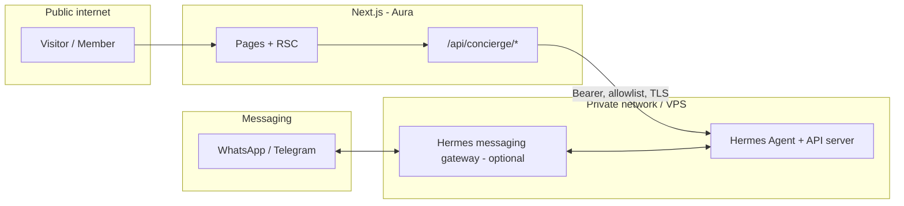
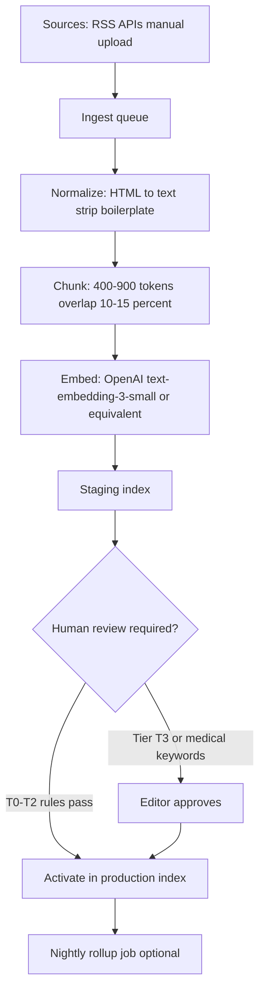
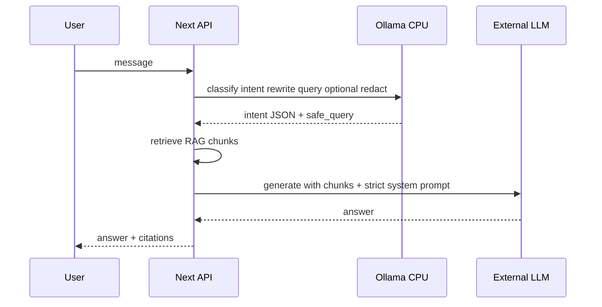

# Hermes Agent Integration & “Beauty × Tech” Revamp Plan

**Status:** Planning (baseline code tagged `pre-revamp` on `main`)  
**Primary code:** `aura-project-v1` (Next.js App Router, Clerk, treatment pages, admin, blog)  
**Related vision docs:** [Aura-Project - Product Owner Ideas Document](./Aura-Project%20-%20Product%20Owner%20Ideas%20Document.md), [PRD](./Aura-Project%20-%20Product%20Requirements%20Document.md), [SRS](./Aura-Project%20-%20Software%20Requirements%20Specification.md)

---

## 1. Purpose of this document

Consolidate **brainstorming, architecture choices, and a careful delivery sequence** for:

- Positioning Aura as a **tech-forward HK beauty** destination (retention + booking, not hype alone).
- Optional use of **[Nous Hermes Agent](https://github.com/NousResearch/hermes-agent)** as an **AI gateway** (OpenAI-compatible API, messaging gateway, skills/memory), aligned with official docs: [Hermes documentation](https://hermes-agent.nousresearch.com/docs/) including [API server](https://hermes-agent.nousresearch.com/docs/user-guide/features/api-server) and [MCP](https://hermes-agent.nousresearch.com/docs/user-guide/features/mcp).

This plan **does not** assume every idea in external “Beauty × Crypto × AI” pitch decks is launch-safe (legal, clinical marketing, or engineering). It separates **MVP**, **phase 2**, and **explicitly deferred** items.

**Implementation depth:** **§7** (knowledge bank, RAG at scale, improvement without RL) and **§8** (optional **Ollama** CPU sidecar, model picks, hybrid routing) are the **execution spec** to follow after the executive roadmap in **§6**.

---

## 2. Executive summary

| Question | Recommendation |
|----------|----------------|
| Greenfield new repo? | **No** for positioning alone. Revamp **in place** on existing Next.js app unless stack or security forces a split (see §10). |
| Hermes on day one? | **Optional.** Ship **Next.js Route Handler → LLM** first if time-to-market matters; add Hermes when you need **gateway (WhatsApp/Telegram), cron, skills loop**, or a **dedicated agent host**. |
| Browser → `localhost:8642`? | **Never in production.** Hermes (or any LLM gateway) sits **server-side** or on a **private VPS**; the public site calls **only** your Next API (auth, rate limits, audit). |
| NFT / USDT at launch? | **Defer.** Product Owner doc already treats on-chain loyalty as **exploratory**. Launch **Clerk + DB “Aura Tokens”** (closed loop) first; revisit NFT/crypto with legal/product review. |
| Beauty “databank” + trends? | **§7:** Postgres + vectors + **trust tiers** + ingestion + rollups; **not** “local LLM = infinite knowledge.” |
| Local CPU LLM on Hostinger? | **§8:** **Optional** after KB-2; default **external** generation; local for **routing / redaction** only if needed; **no RL training** on VPS. |

---

## 3. What Hermes Agent is (in Aura context)

Hermes is a **Python-based agent runtime** with:

- **OpenAI-compatible HTTP API** (documented port for local dev is commonly cited as **8642**; treat port as **configurable** per [API server](https://hermes-agent.nousresearch.com/docs/user-guide/features/api-server) docs).
- **Messaging gateway** (Telegram, Discord, Slack, WhatsApp, etc.) for “concierge outside the website.”
- **Memory, skills, MCP, scheduling** for longer-lived operator workflows.

**Implication:** Hermes is **not** a drop-in React component. Integration is **infrastructure + one thin API layer** in Aura, not a replacement for Next.js.

---

## 4. Target architecture (recommended)

**Rules:**

1. **All** browser chat traffic: `U → Aura /api/...` only.
2. Aura server (Route Handler or server action) forwards to Hermes **or** to OpenAI/OpenRouter/etc.
3. Secrets (`HERMES_API_KEY`, model keys) **only** on server env (Vercel / VPS), never `NEXT_PUBLIC_*` for privileged keys.

---

## 5. Hermes vs “LLM inside Next only”

| Capability | Hermes path | Next-only LLM (e.g. Vercel AI SDK + provider) |
|------------|-------------|-----------------------------------------------|
| Website chat MVP | Possible, adds ops | **Faster**, fewer moving parts |
| WhatsApp / Telegram concierge | **Strong fit** (gateway) | Requires separate BSP or custom bridge |
| Skills / self-improving loop | **Hermes differentiator** | Not native; you’d build custom |
| Memory across sessions | Hermes + policies | Your DB + RAG + strict PII policy |
| Team already runs Hermes 24/7 | Hermes wins | N/A |

**Decision guideline:** Start **Next-only** for `/concierge` MVP **if** the goal is HK-language Q&A + routing to booking links. Introduce **Hermes** when you commit to **messaging-channel parity** or **operator-grade** agent tooling.

---

## 6. Phased roadmap (careful order)

### Phase 0 — Product & IA (no new infra)

- One **primary user job:** choose concern → understand treatment → **book / WhatsApp**.
- Reduce overlapping routes; strengthen **mobile CTA** on treatment templates.
- Replace homepage **mocks** with admin/CMS-backed or DB-backed content when available.

### Phase 1 — AI Concierge MVP (Aura-owned API)

- New routes: e.g. `src/app/concierge/page.tsx` + `src/app/api/concierge/chat/route.ts`.
- **System prompt** grounded in **approved salon copy** (services, contraindications, “not medical advice”).
- Languages: **EN / 繁中** (align with existing `LanguageProvider`).
- Guardrails: rate limit, max tokens, logging, **human handoff** (phone, WhatsApp, in-salon).
- **No** client-side calls to Hermes URL.

### Phase 2 — Booking & retention glue

- Deep links: Cal.com / Calendly / WhatsApp Business **from** concierge replies.
- Email/SMS reminders per SRS (Resend/Twilio) — can be **outside** Hermes initially.
- Optional: Hermes **cron** for internal summaries / staff digests (not customer medical content).

### Phase 3 — Hermes as private gateway (optional)

- Deploy Hermes on **VPS** (or approved host), TLS + IP allowlist or mTLS from Aura API egress.
- Configure [API server](https://hermes-agent.nousresearch.com/docs/user-guide/features/api-server) auth; rotate keys.
- Aura `POST /api/concierge/chat` proxies to `https://hermes.internal.../v1/chat/completions` with **salon system prompt** and tool policy.

### Phase 4 — Messaging channels

- `hermes gateway` for **WhatsApp/Telegram** per [messaging docs](https://hermes-agent.nousresearch.com/docs/user-guide/messaging).
- Website and messaging share **same business rules** (pricing snippets, booking links) via a small **policy JSON** or DB to avoid drift.

### Phase 5 — Loyalty & “crypto trend”

- **Ship:** Clerk user + **Aura Circle / Aura Tokens** in app DB (per Product Owner doc).
- **Explore later:** NFT tiers, USDT checkout — **only** with legal/accounting sign-off and support processes.

**Alignment with detailed implementation:** Phases **KB-0 → KB-3** and **LLM-0 → LLM-2** in §7–§8 map onto Phase 0–2 above; Hermes (§3–§4) layers in from **Phase 3–4** when messaging or agent-host is required.

---

## 7. Beauty AI knowledge bank (databank) — detailed implementation plan

This section answers: **how we store and refresh “everything beauty-related”** (news, products, trends, fashion) without collapsing RAG quality, and **without mistaking “local LLM” for “continuous learning.”**

### 7.1 Problem framing (correct mental model)

| Layer | What it is | Wrong assumption |
|-------|------------|------------------|
| **Knowledge** | Curated + time-stamped **documents and chunks** in a DB + vector index | “Bigger RAG = always smarter” (noise rises faster than coverage) |
| **Inference** | The **model** that reads retrieved chunks (usually **external API** at MVP) | “Local LLM trains itself with RL on my VPS” (not feasible / not the first lever) |
| **Improvement loop** | **Evals**, human review, prompt changes, retrieval tuning, ingestion rules | Same as “RL on local GPU” — **different** engineering work |

**Reinforcement learning / weight updates** for a strong chat model are **out of scope** for Hostinger CPU VPS and for salon MVP. “Continuous improvement” means **better data, retrieval, and governance** first; optional **GPU cloud fine-tuning** is a late-stage research product if you ever have clean labelled data and legal clearance.

### 7.2 Trust tiers (non-negotiable for beauty claims)

All ingested material is tagged at ingest (metadata) and used to **filter retrieval**:

| Tier | Source examples | Retrieval policy | Human review |
|------|-----------------|------------------|--------------|
| **T0 — Canonical** | Your approved treatment copy, pricing policy, FAQs, consent text | **Always eligible**; highest rank in re-ranker | Initial + change control |
| **T1 — Owned editorial** | Your blog, newsletters, Instagram captions you export | Eligible; prefer for “brand voice” | Spot-check |
| **T2 — Curated third-party** | Licensed feeds, vetted HK beauty media list | Eligible; **date + topic** filters | Periodic audit |
| **T3 — Raw web / RSS** | Broad beauty news | **Staging only** until promoted to T2 | **Approve** before production index |

Concierge **system prompt** must state: answers for medical-sounding questions defer to **T0** + **human handoff**; T3 never alone for contraindications.

### 7.3 Data model (logical schema — implement with Prisma + Postgres per SRS)

Minimum tables (names illustrative):

- `knowledge_documents` — `id`, `tier`, `source_url`, `title`, `language`, `published_at`, `fetched_at`, `hash`, `status` (`staging` \| `active` \| `archived`), `trust_score`, `topics[]`
- `knowledge_chunks` — `id`, `document_id`, `chunk_index`, `text`, `token_count`, `embedding_id` / `vector` (if pgvector)
- `knowledge_rollups` — `id`, `period_start`, `period_end`, `topic`, `summary_text` (used to shrink RAG context for “trends” queries)
- `ingestion_runs` — `id`, `started_at`, `status`, `stats` (JSON), `error_log`
- `chat_sessions` / `chat_messages` (optional) — for audit, **PII minimization**, rate limits; align with retention policy

**Embeddings:** store **embedding model name + version** per chunk row so you can **re-embed** when the embedder changes.

### 7.4 Ingestion pipeline (implement as cron + workers on VPS or serverless jobs)

**Operational rules**

- Respect `robots.txt` and terms of each source; prefer **official APIs** or licensed bundles.
- **Deduplicate** by URL hash + simhash near-duplicates.
- **Language detect**; store `zh-HK`, `zh-CN`, `en` separately where possible.
- **Time decay:** for trend queries, prefer `published_at` within **90 days** unless user asks historical.

### 7.5 Retrieval strategy (how we beat “RAG has limits”)

Use **all** of the following together (none replaces the others):

1. **Hybrid retrieval:** BM25 (keyword) + vector; merge with RRF or weighted score.
2. **Metadata pre-filter:** e.g. `tier in (T0,T1)` for “pricing”; `topic in (skincare)` + `language=zh-HK`.
3. **Re-ranking:** small cross-encoder or API re-rank step on top **20** chunks → final **5–8** passed to LLM.
4. **Hierarchical context:** for “what’s trending,” retrieve **rollups** first; only then drill into raw articles if user insists.
5. **“Too many documents” fix:** **nightly summarization** (external LLM) batches T2/T3 into **rollup documents** (§7.2 T1-like summaries) that enter the index as **fewer, higher-signal** chunks.

### 7.6 Hermes skills vs RAG (division of labour)

| Mechanism | Holds | Example |
|-----------|--------|---------|
| **RAG / knowledge bank** | Evidence, citations, trends, product facts | “What is exosome skincare?” with dated sources |
| **Hermes skills (or app-level tool specs)** | **Procedures**: how to book, escalation paths, forbidden claims | “If user asks diagnosis → reply template + WhatsApp link” |

Skills should stay **short and versioned**; long factual content lives in **T0–T2**.

### 7.7 Continuous improvement (no local RL required)

Run a **monthly** (then weekly) cycle:

1. **Review queue:** sample 50–100 real (redacted) conversations; tag failure mode (`bad_retrieval`, `hallucination`, `tone`, `unsafe`).
2. **Golden set:** maintain **100–300** fixed questions (EN + 繁中) with expected behaviour (`must_cite_T0`, `must_refuse`, `must_handoff`).
3. **Regression:** any prompt or index change must pass golden set in CI (or manual pre-release).
4. **Corpus metrics:** % queries with **no** T0 hit; top **orphan** questions → add T0 FAQ.
5. **Optional later:** export labelled pairs for **vendor fine-tuning** on GPU cloud — **explicit** project, not default.

### 7.8 Phased delivery — knowledge bank (KB)

| Phase | Deliverable | Done when |
|-------|-------------|-----------|
| **KB-0** | Prisma schema + empty tables + admin flag to upload **T0** PDFs/Markdown | Editors can publish canonical chunks |
| **KB-1** | Ingestion worker + staging index + promote workflow | T3 never reaches prod without approve |
| **KB-2** | `/api/concierge/chat` uses **retrieve → rerank → generate** with citations | Latency p95 under target (e.g. < 8s) |
| **KB-3** | Nightly rollups + trend topic pages fed from rollups | “Trending” answers cite rollups, not 50 raw URLs |

**Environment variables (server only):** `DATABASE_URL`, `EMBEDDING_API_KEY`, `EMBEDDING_MODEL`, `RERANKER_API_KEY` (if used), `INGEST_CRON_SECRET`.

---

## 8. Local CPU LLM on Hostinger — required or not; how to implement

Hostinger **KVM VPS has no GPU**; inference is **CPU-only**. That is **fine for narrow sidecar tasks**, not for training or for GPT-4-class open-ended chat at scale.

### 8.1 Decision: is local CPU LLM required?

| Scenario | Local CPU LLM | Primary model |
|----------|---------------|-----------------|
| **MVP concierge** (HK Q&A + booking links + T0 RAG) | **Not required** | External API (OpenAI / OpenRouter / etc.) |
| **Strict “raw text never leaves HK/VPS”** policy | **Consider** small local model for **full** chat (quality trade-off) or **hybrid** (see below) | Still may need external for quality |
| **Cost control** at very high volume | Optional: route **simple** intents to local | External for complex |
| **PII scrubbing** before external API | **Recommended pattern:** local **tiny** model OR rules + NER **before** send | External for generation |
| **Hermes “continuous improvement” as RL** | **Not** solved by local CPU LLM | Agent memory/skills + §7.7 process |

**Default recommendation for Aura:** **LLM-0 — no Ollama in production** until KB-2 is stable. Add **LLM-1** (Ollama sidecar) only when you have a concrete requirement: redaction, offline dev, or high-volume **classification** only.

### 8.2 If we add local CPU LLM: recommended runtime and placement

- **Runtime:** **[Ollama](https://ollama.com)** on the **same Linux VPS** as Nginx (or a **second** small VPS). Bind to **`127.0.0.1:11434`** only.
- **Exposure:** Nginx **does not** expose Ollama publicly. Only **Next.js Route Handler** (same machine) or **private network** calls it with **no** public route.
- **If Next.js is on Vercel:** Ollama on Hostinger is still usable via **TLS + API key** to a small **BFF** on the VPS (e.g. `POST https://ollama-bff.yourdomain.com/classify` that forwards to localhost Ollama). Prefer **Cloudflare Tunnel** or IP allowlist if you can pin egress (Vercel IPs are awkward — **same-VPS Next** is simpler).

### 8.3 Model selection (CPU, English + Chinese, **April 2026** guidance — re-benchmark on your box)

**Goal of local model here:** short outputs: **intent classification**, **language detect**, **PII redaction spans**, **query rewrite for RAG** — **not** long empathetic beauty essays.

| VPS RAM (approx) | Ollama model tag (examples) | Role | Notes |
|------------------|----------------------------|------|--------|
| **4 GB** | Avoid full chat; rules + API only | — | Too tight for useful multilingual gen |
| **8 GB** | `llama3.2:3b` or `phi3:mini` | Intent + rewrite | Fast; **ZH coverage weaker** — test HK Cantonese prompts explicitly |
| **8–16 GB** | `qwen2.5:3b` / `qwen2.5:7b` (quantized pull via Ollama) | Intent + light gen | **Stronger multilingual**; 7B may be slow on CPU |
| **16 GB+** | `qwen2.5:7b` Q4 / `llama3.1:8b` Q4 | Heavier local gen | Still **slower** than API; measure tokens/sec |

**Procedure before locking a model**

1. On staging VPS: `ollama pull <tag>` then scripted **50** representative prompts (EN + 繁中 + mixed HK spoken style).
2. Measure **latency p50/p95**, **RAM peak**, **CPU steal** under Hostinger load.
3. If ZH quality insufficient for **customer-facing** generation, keep local for **routing only**; use **external** for final answer.

### 8.4 Hybrid routing (recommended pattern when Ollama exists)

**Config flags:** `LOCAL_LLM_ENABLED=true`, `OLLAMA_HOST=http://127.0.0.1:11434`, `OLLAMA_MODEL=qwen2.5:3b`, `ROUTING_USE_LOCAL=true`, `GENERATION_USE_LOCAL=false` (default false).

### 8.5 Phased delivery — local LLM (LLM)

| Phase | Deliverable | Done when |
|-------|-------------|-----------|
| **LLM-0** | No Ollama; external only + KB-2 retrieval | MVP shipped |
| **LLM-1** | Ollama on VPS; **internal** `/api/internal/classify` (admin IP or secret) | Intent labels match golden set ≥ agreed threshold |
| **LLM-2** | Wire §8.4 hybrid path; **generation** still external unless policy demands | p95 latency within budget; no public Ollama |

### 8.6 What we explicitly do **not** do on Hostinger CPU

- **No** foundation-model **RL training** or heavy **LoRA** training on production VPS.
- **No** “embed the entire internet” into RAG without **tiering + rollups** (§7.5).
- **No** customer-facing **medical diagnosis** automation — local or cloud.

---

## 9. Feature brainstorm (mapped to prudence)

Ideas from market / strategy research, **classified**:

| Feature | Value | Launch tier | Notes |
|---------|--------|-------------|--------|
| AI skin / treatment Q&A | High | Phase 1 | Ground in salon-approved facts; no diagnosis. |
| AR try-on (Banuba / Perfect Corp) | Medium | Phase 2+ | Licensing, brand fit, performance on mobile. |
| Smart booking agent | High | Phase 2 | Start with **links + structured intake**; full auto-booking is hard. |
| Post-visit AI tips | Medium | Phase 3–4 | Prefer **opt-in** WhatsApp; watch PIPL/privacy messaging. |
| NFT loyalty | Uncertain | Phase 5 exploratory | Align with existing “not core launch” stance in Ideas doc. |
| Crypto checkout | Uncertain | Phase 5+ | Heavy compliance; not a website-only toggle. |
| AI before/after **generator** | Risky | **Defer / avoid** | Misrepresentation and advertising-law risk in beauty. |
| Auto blog from agent research | Low–medium | Phase 4 | Needs **human editorial** pass for brand and claims. |

---

## 10. Security & compliance checklist (non-negotiable)

- [ ] No privileged LLM keys in browser bundles.
- [ ] Rate limiting + abuse monitoring on `/api/concierge/*`.
- [ ] **PII minimization** in logs; retention policy for chat transcripts.
- [ ] **HK PDPO / PIPL** awareness for cross-border processing if using overseas APIs.
- [ ] Marketing: avoid **medical claims**; label AI output as **informational**.
- [ ] Hermes host: **TLS**, firewall, non-root service user, automated updates.
- [ ] If Ollama (§8): bound to **localhost** only; never exposed without auth; **model tags pinned** in deploy (avoid surprise `pull` upgrades).

---

## 11. Engineering backlog (starter tickets)

**Core concierge**

1. **Docs:** This file + PMP cross-link (done when merged).
2. **IA:** Navigation audit doc + redirect map (treatment duplicates).
3. **Concierge:** `/concierge` UI + `/api/concierge/chat` stub (returns static FAQ until model wired).
4. **Config:** `HERMES_BASE_URL`, `HERMES_API_KEY` (optional) + `OPENAI_API_KEY` / `OPENROUTER_API_KEY` for fallback — **server only**.
5. **Tests:** Playwright smoke for concierge page + API 401 without session (if auth required).
6. **Observability:** Structured logs for model errors (no PII in message bodies in logs).

**Knowledge bank (§7)**

7. **KB-0:** Prisma models for `knowledge_documents`, `knowledge_chunks`, `knowledge_rollups`, `ingestion_runs`; admin upload for **T0** files.
8. **KB-1:** Worker/cron: fetch → normalize → chunk → embed → **staging**; promote API (role-guarded); keyword index for hybrid search.
9. **KB-2:** Wire retrieval + re-rank + `chat` completion with **citations** + tier filters; load tests on p95 latency.
10. **KB-3:** Nightly rollup job + “trends” query path; archive job for aged T3.

**Golden set & quality (§7.7)**

11. **Eval:** Repo folder or DB seed with **100–300** golden Q&A (EN + 繁中); script scores pass/fail on each deploy.

**Optional local CPU LLM (§8)**

12. **LLM-1:** Install Ollama on VPS; `127.0.0.1` bind; systemd unit; **no** public port; benchmark script (§8.3).
13. **LLM-2:** Implement hybrid router flags; default `GENERATION_USE_LOCAL=false`; document ops runbook (disk, `ollama ps`, model pull pinning).

---

## 12. When to reconsider a new repository

Create a **new** Next.js app only if:

- Security review demands **isolation** of experimental agent surface from admin/CMS, **or**
- You adopt a **different deployment model** (e.g. separate `apps/web` monorepo with shared UI package).

Otherwise: **tag + branch** from `main` (e.g. `revamp/concierge`) and merge incrementally.

---

## 13. References

- Hermes Agent repo: https://github.com/NousResearch/hermes-agent  
- Hermes docs hub: https://hermes-agent.nousresearch.com/docs/  
- API server feature: https://hermes-agent.nousresearch.com/docs/user-guide/features/api-server  
- MCP integration: https://hermes-agent.nousresearch.com/docs/user-guide/features/mcp  
- Messaging gateway: https://hermes-agent.nousresearch.com/docs/user-guide/messaging  
- Ollama (local inference runtime): https://ollama.com  
- pgvector (if using Postgres embeddings): https://github.com/pgvector/pgvector  

Internal: **Memory MCP** in this repo remains a **developer memory tool**, not the customer-facing concierge; do not conflate the two in architecture diagrams for stakeholders.

---

## 14. Document maintenance

| Trigger | Action |
|---------|--------|
| Hermes major version / API path change | Update §3–§4 and env names; link new upstream doc. |
| Knowledge / RAG stack change (DB, embedder, reranker) | Update §7 schema, §7.5 retrieval, and env var list in §7.8. |
| Local LLM model swap (Ollama tag, RAM tier) | Update §8.3 table and §8.5 LLM phases; re-run benchmark procedure. |
| Phase completed | Move items in [Project Management Plan](./Project%20Management%20Plan.md) “Completed Tasks” with date. |
| Legal stance on NFT/crypto | Update §6 Phase 5 and §9 feature table. |

**Last updated:** 2026-04-19
